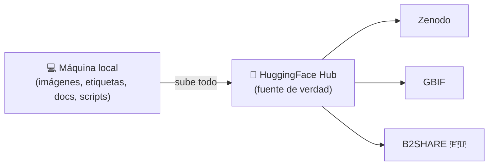
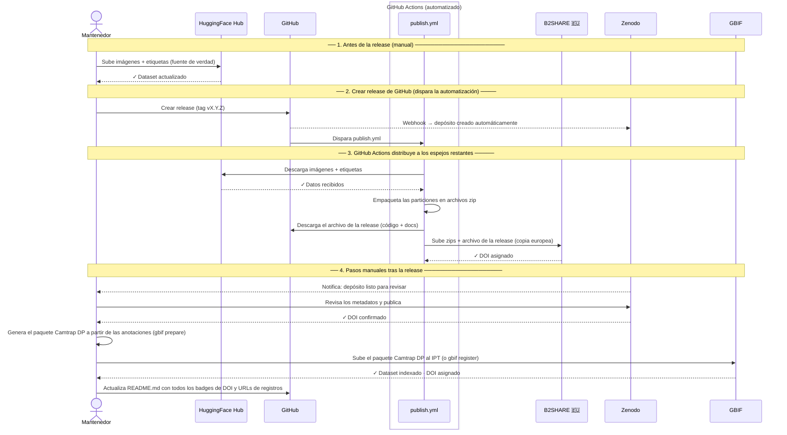

# Guía de publicación

Este documento explica cómo publicar y mantener sincronizado DonaDataset entre todos
los repositorios externos. Está dirigido al **mantenedor del dataset**.

---

## Visión general

Para maximizar la visibilidad, accesibilidad y preservación a largo plazo de
DonaDataset, el dataset se publica en múltiples repositorios reconocidos
internacionalmente. Cada plataforma sirve a una comunidad distinta — desde
investigadores de machine learning hasta ecólogos y gestores de datos — asegurando que
DonaDataset se pueda encontrar y citar independientemente del campo o la herramienta con
la que trabaje cada usuario.

Todo empieza en la máquina local del mantenedor y se sube a **HuggingFace Hub**, que
actúa como única fuente de verdad. A partir de ahí, el dataset (o las partes relevantes
para cada plataforma — ver [Qué se almacena dónde](#que-se-almacena-donde)) se publica
hacia el resto de repositorios:



Aunque hay muchos repositorios disponibles a nivel mundial, se han seleccionado los
siguientes en base a su relevancia para el alcance del dataset (biodiversidad, visión
por computador, ciencia abierta), su alineación con el contexto de financiación europea
del proyecto WildINTEL, y su adopción por parte de la comunidad investigadora
internacional:

<table>
<thead>
<tr><th>Repositorio</th><th>Tipo</th><th>DOI</th><th>Audiencia</th><th>Estado de implementación</th></tr>
</thead>
<tbody>
<tr><td><a href="../publishing-huggingface/">HuggingFace Hub</a></td><td>Especializado (ML)</td><td>Sí</td><td>Comunidad de IA / ML</td><td>En pruebas</td></tr>
<tr><td><a href="../publishing-zenodo/">Zenodo</a></td><td>Archivo de ciencia abierta</td><td>Sí</td><td>Comunidad científica</td><td>En pruebas</td></tr>
<tr><td><a href="../publishing-gbif/">GBIF</a></td><td>Datos de biodiversidad</td><td>Sí</td><td>Comunidad de ecología / biología</td><td>En pruebas</td></tr>
<tr><td><a href="../publishing-b2share/">B2SHARE (EUDAT)</a></td><td>Datos de investigación europeos</td><td>Sí</td><td>Comunidad científica de la UE</td><td>En pruebas</td></tr>
<tr class="status-planned"><td>Dataverse</td><td>Repositorio de datos de investigación</td><td>Sí</td><td>Comunidad científica</td><td>En estudio</td></tr>
<tr class="status-planned"><td>Arias Montano (UHU)</td><td>Repositorio institucional</td><td>Sí</td><td>Universidad de Huelva</td><td>En estudio</td></tr>
<tr class="status-planned"><td>Roboflow Universe</td><td>Especializado (CV / YOLO)</td><td>No</td><td>Comunidad de visión por computador</td><td>En estudio</td></tr>
<tr class="status-planned"><td>Kaggle Datasets</td><td>Generalista (ML)</td><td>Sí</td><td>Comunidad de ML</td><td>En estudio</td></tr>
</tbody>
</table>

---

## Qué se almacena dónde

DonaDataset se compone de los siguientes tipos de contenido:

- **Imágenes + Etiquetas** — las fotografías en bruto de las cámaras trampa capturadas
  en el Parque Nacional de Doñana (ficheros binarios grandes que forman el grueso del
  dataset), junto con un fichero de anotación YOLO por imagen (identificador de clase
  de especie, coordenadas del cuadro delimitador, puntuación de confianza) que convierte
  esas fotografías en bruto en un dataset de entrenamiento supervisado. Algunos
  repositorios alojan estos ficheros directamente (✅); otros deliberadamente no lo
  hacen y en su lugar enlazan a dónde viven realmente en HuggingFace Hub (🔗) — p. ej.
  `related_identifiers` de Zenodo, `alternate_identifier` de B2SHARE, o `media.filePath`
  de GBIF cuando se construye con `--link-media-to-huggingface`.

- **Catálogo de especies** — el fichero `metadata/classes.yaml`, que mapea cada
  identificador numérico de clase al nombre común y científico de la especie de mamífero
  correspondiente. Es la clave que hace que las etiquetas sean legibles y
  científicamente significativas.

- **Scripts** — utilidades Python incluidas en este repositorio: `download.py` para
  descargar el dataset, `upload.py` para publicar nuevas imágenes en HuggingFace Hub, y
  `validate.py` para comprobar la integridad del dataset.

- **Documentación** — el sitio MkDocs (esta guía y páginas relacionadas) y el
  `README.md`, que describen el dataset, su estructura y cómo usarlo.

- **Paquete Camtrap DP** — una representación del dataset en formato
  [Camtrap DP](https://camtrap-dp.tdwg.org/) para GBIF. Cada animal detectado se
  convierte en una observación con nombre de especie, fecha y ubicación del despliegue,
  haciendo que los datos sean descubribles por ecólogos e investigadores en conservación
  de todo el mundo.

Debido a la naturaleza de los distintos repositorios — algunos especializados en
almacenamiento de ficheros grandes, otros en registros científicos citables o estándares
de biodiversidad — no siempre es posible almacenar imágenes y metadatos juntos en el
mismo sitio. La tabla siguiente muestra qué se almacena en cada repositorio:

| Repositorio | Imágenes + Etiquetas | Catálogo de especies | Scripts | Documentación | Paquete Camtrap DP |
|---|:---:|:---:|:---:|:---:|:---:|
| Repositorio de GitHub | 🔗 | ✅ | ✅ | ✅ | |
| HuggingFace Hub | ✅ | ✅ | | | |
| Zenodo | 🔗 | ✅ | | | |
| GBIF | 🔗 | ✅ | | | ✅ |
| B2SHARE (EUDAT) 🇪🇺 | 🔗 | ✅ | | | |

> ℹ️ En **HuggingFace Hub**, las imágenes y las etiquetas no se suben como ficheros
> sueltos — van empaquetadas juntas dentro de shards `.tar` (`data/<split>/*.tar`),
> cada uno agrupando ficheros `images/<split>/...` y `labels/<split>/...`
> correspondientes para un lote del dataset. Consulta
> [publishing-huggingface.md](publishing-huggingface.md#4-como-lo-subimos-cada-fichero-explicado)
> para ver el desglose completo de lo que hay dentro de un shard.

---

## Generar el dataset

Antes de poder publicar nada en ningún sitio, la fuente en bruto anotada tiene que
convertirse en el dataset YOLO limpio y particionado del que parten todas las vías de
publicación:

```bash
donadataset generate real
```

### Qué espera como entrada

- `--source` (por defecto `GENERATE.source`, `<Documents>/donadataset/source`) — el
  dataset de cámaras trampa en bruto, **ya particionado** en `images/<train,val,test>/`
  y `labels/<train,val,test>/`. `generate real` no particiona nada por sí mismo; las
  particiones ya tienen que existir en la fuente.
- `--classes-map` (por defecto `metadata/source_classes.yaml`) — un YAML plano
  `id: nombre` con el esquema de clases original de la propia fuente (18 clases, ids
  0–17 hoy). Es el esquema de anotación previo, no el `metadata/classes.yaml` público
  del proyecto.
- Una etiqueta YOLO `.txt` por imagen, en la misma ruta relativa bajo `labels/<split>/`
  — las imágenes sin etiqueta correspondiente se descartan y se cuentan aparte en el
  resumen.

> 💡 [`examples/source_dataset`](https://github.com/wildintelproject/donadataset/tree/main/examples/source_dataset)
> en este repositorio es un pequeño dataset de ejemplo con exactamente esta
> estructura, que cubre deliberadamente cada rama del pipeline de abajo (una clase
> descartada, una etiqueta que falta, una imagen duplicada con dos extensiones, una
> etiqueta que mezcla clases conservadas y eliminadas, e imágenes normales que pasan
> tal cual) — consulta su propio `README.md` para el desglose completo de qué
> ejercita cada fichero, y un comando listo para probarlo.

### Qué hace

- Descarta por completo cualquier imagen cuya etiqueta contenga alguna de
  `--remove-class-id` (por defecto `10, 17` — Homo sapiens y Vehicle en el esquema
  fuente).
- Remapea los ids de clase antiguos restantes a ids nuevos y consecutivos (cerrando los
  huecos que dejan las clases eliminadas) y reescribe cada fichero de etiquetas
  conservado con los nuevos ids.
- Detecta y descarta imágenes duplicadas dentro de cada partición, según
  `--duplicate-key-mode`: `stem` (por defecto — mismo nombre de fichero,
  independientemente del subdirectorio) o `relative_stem` (solo misma ruta relativa).
  Cuando se encuentran duplicados, se conserva una copia, priorizando la que tenga
  fichero de etiquetas.
- Imprime un resumen por partición (`total_images`, `duplicate_groups`,
  `duplicated_images_removed`, `kept_images`, `removed_images`, `missing_labels`,
  `removed_missing_labels`, más una comprobación de consistencia `total_control`) y el
  mapeo completo de ids de clase antiguo → nuevo — nada se escribe en un fichero de
  report, solo se imprime en la consola.

### Qué genera como salida

Escribe en `--output` (por defecto `GENERATE.output`, `<Documents>/donadataset/output`
— **se vacía por completo** antes de generar):

```
output/
├── images/<split>/...     ← imágenes conservadas, mismas rutas relativas que la fuente
├── labels/<split>/...     ← etiquetas YOLO remapeadas
└── donana_filtered.yaml   ← nc, names, y rutas absolutas de imágenes por partición
```

Esta es exactamente la estructura `images/<split>/` + `labels/<split>/` que espera
`donadataset publish huggingface prepare`/`pipeline` (y, a través de él, `publish all`)
en `--source-dataset-dir` — consulta el [Mapa de publicación](#mapa-de-publicacion) de
abajo.

> ℹ️ `donadataset generate toy` es un comando relacionado pero distinto: no toca la
> fuente en bruto en absoluto, *subsamplea* una salida ya generada de `generate real`
> (con un tope por clase y una semilla aleatoria) — útil para una prueba local rápida,
> no forma parte de la vía de publicación.

---

## Mapa de publicación

**[HuggingFace Hub](publishing-huggingface.md)**

La fuente de verdad principal — la única plataforma que almacena las imágenes y
etiquetas YOLO reales. Cubre la configuración inicial de cuenta/token, cada fichero
exportado explicado, y la secuencia completa `prepare` → `upload` → `release` →
sincronización del DOI (manual, `pipeline` no interactivo, o `wizard` interactivo).

**[Zenodo](publishing-zenodo.md)**

Un registro de dataset enlazado que proporciona un DOI citable y permanente —
solo metadatos y evidencia, las imágenes y etiquetas en sí permanecen en HuggingFace
Hub. Cubre la configuración inicial de cuenta/token, cada fichero subido explicado, y
la secuencia completa hasta la publicación final e irreversible.

**[GBIF](publishing-gbif.md)**

Convierte el dataset en un paquete Camtrap DP para la comunidad de biodiversidad/
ecología, publicado o bien mediante una subida manual al IPT o mediante la API de
Registry con script. Cubre la configuración inicial de cuenta, exactamente qué deriva
`gbif prepare` de los datos frente a qué inventa como marcador de posición, y ambas
vías de publicación.

**[B2SHARE (EUDAT)](publishing-b2share.md)** 🇪🇺

La copia europea de los metadatos y la evidencia del dataset, alojada íntegramente en
servidores de la UE — el mismo patrón de registro enlazado que Zenodo. Cubre la
configuración inicial de cuenta/comunidad/token, cada fichero subido explicado, y la
secuencia completa de publicación.

---

## Lista de comprobación para una nueva versión del dataset

**Imágenes + etiquetas**
- [ ] Subir nuevas imágenes y etiquetas a **HuggingFace Hub**.

**Código + metadatos (archivo)**
- [ ] Actualizar `metadata/classes.yaml` y `metadata/dataset.yaml` si hace falta.
- [ ] Crear una **release de GitHub** (dispara Zenodo automáticamente).
- [ ] Revisar y publicar el depósito de **Zenodo**; actualizar el badge del DOI en
      `README.md`.

**Copia europea — imágenes + código (B2SHARE)**
- [ ] Subir los archivos zip y el archivo de la release actualizados a **B2SHARE** y
      publicar la nueva versión.

**Registros de biodiversidad**
- [ ] Generar un paquete Camtrap DP actualizado (`gbif prepare`) y volver a publicar en
      **GBIF**.

**Referencias**
- [ ] Actualizar los badges de DOI y las URLs de los registros en `README.md`.
- [ ] Actualizar el número de versión en `README.md` y `docs/dataset-description.md`.

---

## Diagrama del flujo de publicación

El siguiente diagrama muestra la secuencia completa de pasos para publicar una nueva
versión de DonaDataset.



---

## Automatizar la publicación de nuevas versiones

Casi todo el proceso de publicación se puede automatizar, de una de estas dos formas
independientes — no son pasos de un mismo pipeline, elige una:

- **Localmente, con la CLI `donadataset publish all`** — necesita el dataset y las
  credenciales de cada integración listas de antemano (ver
  [Requisitos previos](#requisitos-previos) más abajo); el propio comando lo sube a
  HuggingFace Hub como primer paso, y luego continúa con Zenodo, B2SHARE y GBIF. No
  hace falta que nada esté ya publicado en ningún sitio antes de ejecutarlo.
- **Vía GitHub Actions** — el requisito previo en cuanto a los datos es el opuesto:
  este workflow solo *distribuye* lo que ya está en HuggingFace Hub, nunca sube nada
  ahí. El dataset tiene que haberse subido manualmente antes (Paso 1 más abajo); solo
  entonces crear una release de GitHub dispara el resto.

En ambos casos, los pasos que siguen requiriendo intervención manual son los mismos:
revisar el depósito de Zenodo antes de que se publique, y publicar en GBIF.

### Requisitos previos

Ambas opciones de abajo necesitan dos cosas listas de antemano:

1. **El dataset generado** — consulta [Generar el dataset](#generar-el-dataset) más
   arriba para ver qué espera como entrada y qué produce como salida `donadataset
   generate real`.
2. **Credenciales para cada integración en la que vayas a publicar** — un token de
   acceso (HuggingFace Hub, Zenodo, B2SHARE) o usuario/contraseña (GBIF), cada uno
   guardado una vez mediante `donadataset publish <repo> config set token` (o la
   variable de entorno correspondiente) — consulta la sección "Configuración inicial"
   de las guías de
   [HuggingFace Hub](publishing-huggingface.md#configuracion-inicial),
   [Zenodo](publishing-zenodo.md#configuracion-inicial),
   [B2SHARE](publishing-b2share.md#configuracion-inicial), y
   [GBIF](publishing-gbif.md#configuracion-inicial). `publish all`/`pipeline` fallan
   con un error claro que indica qué token falta, en vez de avanzar a medias y
   quedarse atascados en silencio. GitHub Actions no lee nada de esto — usa sus
   propios Secrets del repositorio (Paso 4 más abajo).
3. **Un tag de git para esta versión.** `huggingface pipeline` (y `publish all` a
   través de él) detecta automáticamente la versión a partir de git: si `HEAD` está
   exactamente sobre un tag como `v1.1.0` cuando lo ejecutas, ese tag (sin la `v`) se
   convierte en la versión publicada en `dataset_info.json`/`CITATION.cff`; si no, se
   queda como el marcador de posición `REPLACE_WITH_VERSION`, porque ni `publish all`
   ni esta llamada a `pipeline` pasan un `--version` explícito. Créalo antes: `git tag
   v1.1.0 && git push origin v1.1.0`. La Opción B necesita el mismo tag también — el
   Paso 2 de abajo crea la release de GitHub basándose en él, en vez de crear uno
   nuevo sobre la marcha.

### Opción A: Localmente, con `donadataset publish all`

La CLI de `donadataset` puede dirigir de principio a fin **HuggingFace Hub, Zenodo,
B2SHARE y GBIF** en un único comando, partiendo del dataset generado arriba:

```bash
donadataset publish all
```

`publish all` no tiene flag `--source-dataset-dir` propio — delega directamente en
`huggingface pipeline`, cuyo valor por defecto es `GENERATE.output` (ver arriba). Si
generaste el dataset en otro sitio, reconfigura ese ajuste primero en vez de intentar
pasar una ruta en la línea de comandos de `publish all`.

Ejecuta el `pipeline` de cada integración en el orden en que dependen unas de otras
(HuggingFace Hub → Zenodo → B2SHARE → GBIF), reutilizando lo que ya hayas guardado con
`donadataset publish <repo> config set ...` — no hacen falta flags si cada integración
ya está configurada. El propio `pipeline` de Zenodo normalmente se pausa para pedirte
que vuelvas a ejecutar `huggingface upload` a mano tras reservar un DOI (para que el
repo público de HF lo refleje); `publish all` cierra ese hueco por sí solo,
automáticamente, sin preguntar. El **único** paso manual que queda es inevitable:
HuggingFace Hub no tiene API para generar su propio DOI, así que su pipeline se sigue
pausando una vez para que hagas clic en "Generate DOI" en la web y pulses Enter.

Usa `--include`/`--exclude` (separados por comas: `huggingface`, `zenodo`, `b2share`,
`gbif`) para omitir repositorios — `--exclude` los elimina, `--include` siempre gana si
un repositorio acaba en ambos. `--dry-run` imprime los comandos exactos que ejecutaría,
en orden, sin ejecutar ninguno.

```bash
donadataset publish all --exclude b2share      # omitir B2SHARE esta vez
donadataset publish all --dry-run              # previsualizar el plan completo antes
```

### Opción B: Vía GitHub Actions

| Paso | Cómo |
|---|---|
| HuggingFace Hub | ❌ Manual — debe estar subido ya antes de crear la release (Paso 1 más abajo) |
| Zenodo | ✅ Webhook automático disparado por la release de GitHub |
| B2SHARE 🇪🇺 | ✅ GitHub Actions (`publish.yml`) |
| GBIF | ⚠️ Parcial — `gbif prepare` es scriptable, pero subir/publicar todavía requiere la interfaz del IPT o ejecutar `gbif register` a mano |

---

#### Paso 1 — Subir imágenes a HuggingFace Hub (local, requisito previo)

Antes de crear la release, el mantenedor debe subir las imágenes y etiquetas nuevas o
actualizadas desde su máquina local, y hacer público el repositorio — el workflow de
abajo solo distribuye desde HuggingFace Hub, no lo rellena ni lo publica. Usa el mismo
wizard de la CLI descrito en la
[guía de HuggingFace Hub](publishing-huggingface.md):

```bash
donadataset publish huggingface wizard
```

Recorre prepare → upload → hacer público → generar el DOI (manual, en la web) →
reflejarlo localmente, pidiendo confirmación antes del paso irreversible de "hacer
público". Consulta
[publishing-huggingface.md](publishing-huggingface.md#5-comandos-para-publicar) para
el recorrido completo, incluyendo la alternativa no interactiva `pipeline` y los
comandos manuales paso a paso.

---

#### Paso 2 — Crear una release de GitHub (dispara la automatización)

Una vez que las imágenes están en HuggingFace Hub, etiqueta la versión y crea la
release **basada en ese tag** en este repositorio de GitHub:

1. Etiqueta el commit y sube el tag, siguiendo el
   [versionado semántico](https://semver.org/):
   `git tag vX.Y.Z && git push origin vX.Y.Z`.
2. Ve a **Releases → Draft a new release**.
3. Selecciona el tag que acabas de subir (no escribas uno nuevo aquí — la release
   tiene que construirse sobre el tag del paso 1, el mismo en el que se basan los
   metadatos de versión de HuggingFace Hub).
4. Escribe una descripción de la release resumiendo los cambios.
5. Haz clic en **Publish release**.

Esta única acción dispara dos cosas simultáneamente:
- **Zenodo** archiva automáticamente este repositorio y crea un nuevo depósito.
- **GitHub Actions** ejecuta `.github/workflows/publish.yml`.

---

#### Paso 3 — GitHub Actions distribuye a los espejos restantes

El workflow `publish.yml` se ejecuta automáticamente en los servidores de GitHub. Este
workflow:

1. Libera espacio en disco en el runner (~30 GB recuperados).
2. Descarga el dataset completo desde **HuggingFace Hub** (por eso el Paso 1 tiene que
   haber ocurrido ya — si no, no hay nada que descargar).
3. Empaqueta cada partición en un archivo zip (`train.zip`, `val.zip`, `test.zip`).
4. Sube el archivo a **B2SHARE**.
5. Escribe un resumen en la página de la release de GitHub listando los pasos
   completados y pendientes.

Si falla la subida a algún espejo individual, los demás continúan — cada paso usa
`continue-on-error: true`.

> ⚠️ **Espacio en disco:** el runner `ubuntu-latest` tiene ~14 GB libres por defecto.
> El workflow recupera espacio extra al arrancar. Si el dataset supera el espacio en
> disco disponible, considera usar un runner de GitHub más grande (de pago, hasta 64
> GB) o subir las particiones en jobs separados.

---

#### Paso 4 — Configurar los GitHub Secrets (configuración única)

Antes de usar el workflow por primera vez, añade los siguientes secrets en el
repositorio: **Settings → Secrets and variables → Actions → New repository secret**

| Secret | Plataforma | Cómo obtenerlo |
|---|---|---|
| `HF_TOKEN` | HuggingFace Hub | huggingface.co → Settings → Access Tokens |
| `B2SHARE_API_TOKEN` | B2SHARE | b2share.eudat.eu → Account → Personal access tokens |
| `B2SHARE_BUCKET_ID` | B2SHARE | ID del bucket de ficheros del JSON del registro (`links.files`) |
