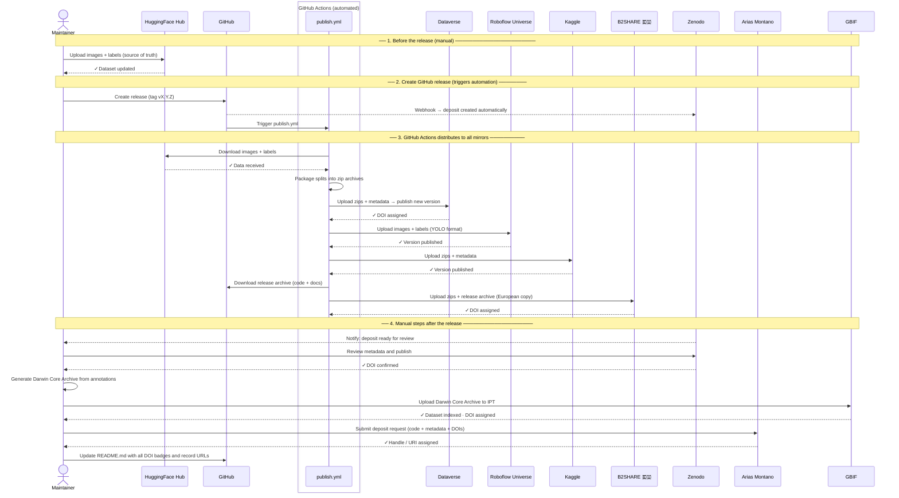

# Publishing Guide

This document explains how to publish and keep DonaDataset synchronized across all external
repositories. It is aimed at the **dataset maintainer**.

---

## Overview

| Repository | Type | DOI | Audience |
|---|---|---|---|
| [HuggingFace Hub](#1-huggingface-hub) | Specialised (ML) | No | AI / ML community |
| [Zenodo](#2-zenodo) | Open science archive | Yes | Scientific community |
| [Dataverse](#3-dataverse) | Research data repository | Yes | Scientific community |
| [Arias Montano (UHU)](#4-arias-montano-university-of-huelva) | Institutional repository | Yes | University of Huelva |
| [Roboflow Universe](#5-roboflow-universe) | Specialised (CV / YOLO) | No | Computer vision community |
| [Kaggle Datasets](#6-kaggle-datasets) | Generalised (ML) | No | ML community |
| [GBIF](#7-gbif) | Biodiversity data | Yes | Ecology / biology community |
| [B2SHARE (EUDAT)](#8-b2share-eudat) | European research data | Yes | EU scientific community |

---

## What is stored where

| What | Where |
|---|---|
| **Images + labels** (the actual data) | HuggingFace Hub (primary) · Dataverse · Roboflow Universe · Kaggle · B2SHARE (🇪🇺 European copy) |
| **Code + metadata + documentation** | GitHub → Zenodo · Arias Montano (UHU) · B2SHARE |
| **Biodiversity occurrence records** | GBIF |

---

## 1. HuggingFace Hub

**URL:** https://huggingface.co/datasets/wildintelproject/donadataset

### First-time setup

1. Create an account at [huggingface.co](https://huggingface.co) and join the
   **wildintelproject** organisation.
2. Install the HuggingFace CLI:
   ```bash
   pip install huggingface-hub
   huggingface-cli login   # paste your access token
   ```
3. Create the dataset repository on the web:
   **New → Dataset → wildintelproject/donadataset** (set to Public, CC BY 4.0).

### Uploading images and labels

```bash
# Upload a specific split (e.g. train)
huggingface-cli upload wildintelproject/donadataset ./data/train train \
  --repo-type dataset

# Upload all splits at once
for split in train val test; do
  huggingface-cli upload wildintelproject/donadataset ./data/$split $split \
    --repo-type dataset
done
```

### Updating the dataset card

The dataset card is the `README.md` inside the HuggingFace repository (not this GitHub repo).
Edit it directly on the HuggingFace web UI or push a `README.md` via the CLI.

### On every new version

1. Upload the new/updated images and labels as above.
2. Update the version tag in the dataset card.
3. Update `metadata/dataset.yaml` in this GitHub repo if splits or class IDs changed.

---

## 2. Zenodo

**URL:** https://zenodo.org

> ⚠️ **What Zenodo hosts:** Zenodo archives the contents of **this GitHub repository**
> (metadata, scripts, documentation). **The images and labels are NOT stored in Zenodo** —
> they live on HuggingFace Hub. The Zenodo deposit exists to provide a citable DOI for the
> dataset and to ensure long-term preservation of the code and metadata.

### First-time setup — GitHub integration (recommended)

1. Log in at [zenodo.org](https://zenodo.org) with your GitHub account.
2. Go to **Account → GitHub**.
3. Find **wildintelproject/donadataset** and toggle it **ON**.
4. Zenodo will now watch this repository for new releases.

### Publishing a new version

1. In this GitHub repository, create a new release:
   **Releases → Draft a new release → Create tag** (e.g. `v1.1.0`) → **Publish release**.
2. Zenodo automatically creates a new deposit and mints a DOI within a few minutes.
3. Go to the Zenodo deposit, review the metadata (title, authors, licence, description),
   and click **Publish** if it is not published automatically.
4. Copy the DOI badge URL and update it in `README.md`:
   ```markdown
   [](https://doi.org/10.5281/zenodo.XXXXXXX)
   ```

> **Note:** Zenodo archives the GitHub repository contents (code + metadata), not the images
> themselves (those live on HuggingFace). Include a clear note in the Zenodo description
> pointing to HuggingFace for the actual data files.

---

## 3. Dataverse

**URL:** https://dataverse.harvard.edu (or another Dataverse instance if preferred)

> 📦 **What Dataverse hosts:** Dataverse acts as a **mirror** of the actual dataset —
> images and labels — for the scientific community. It is the primary alternative to
> HuggingFace Hub for researchers who prefer a traditional academic data repository.
>
> ⚠️ **File size limit:** Harvard Dataverse has a **2.5 GB per-file** limit. Split the
> data by split (`train.zip`, `val.zip`, `test.zip`) before uploading to stay within
> this limit.

### First-time setup

1. Create an account at [dataverse.harvard.edu](https://dataverse.harvard.edu).
2. Request access to or create a **Dataverse collection** for WildINTEL / University of Huelva.
3. Click **Add Data → New Dataset**.

### Filling in the metadata

| Field | Value |
|---|---|
| Title | DonaDataset: Camera-trap mammal dataset from Doñana National Park |
| Author | WildINTEL project team |
| Contact | (project contact email) |
| Description | (copy from `docs/dataset-description.md`) |
| Subject | Earth and Environmental Sciences |
| Licence | CC BY 4.0 |
| Related publication | (add DOI of associated paper when available) |

### Preparing and uploading files

1. Package each split as a zip archive (max 2.5 GB per file):
   ```bash
   zip -r data/train.zip  data/train/
   zip -r data/val.zip    data/val/
   zip -r data/test.zip   data/test/
   ```
2. Upload via the web UI, or use the
   [Dataverse API](https://guides.dataverse.org/en/latest/api/native-api.html):
   ```bash
   for split in train val test; do
     curl -H "X-Dataverse-key: $DATAVERSE_API_TOKEN" \
          -X POST \
          -F "file=@data/${split}.zip" \
          "https://dataverse.harvard.edu/api/datasets/:persistentId/add?persistentId=doi:10.7910/DVN/XXXXXX"
   done
   ```
3. Also upload `metadata/classes.yaml` and `metadata/dataset.yaml` as supplementary files.

### On every new version

1. Open the existing dataset on Dataverse.
2. Click **Edit Dataset → Add New Files**, upload the updated zip archives.
3. Increment the version number and click **Publish**.

---

## 4. Arias Montano (University of Huelva)

**URL:** https://rabida.uhu.es

> 📦 **What Arias Montano hosts:** like Zenodo, Arias Montano archives the contents of
> **this GitHub repository** (metadata, scripts, documentation). **The images and labels
> are NOT stored here** — they live on HuggingFace Hub and Dataverse. The deposit exists
> to provide an institutional citable record at the University of Huelva.

Arias Montano is the institutional open-access repository of the University of Huelva,
managed by the university library service. Deposits are made by request.

### Steps

1. Contact the **Biblioteca de la Universidad de Huelva** to open a deposit:
   - Web: [https://www.uhu.es/biblioteca/](https://www.uhu.es/biblioteca/)
   - Email: biblioteca@uhu.es
2. Provide the following information:
   - Title, authors, abstract (in Spanish and English).
   - Licence: CC BY 4.0.
   - Type of resource: *Dataset*.
   - Links to HuggingFace Hub, Dataverse, and Zenodo (DOI).
   - Associated publication or project (WildINTEL / Biodiversa+).
3. The library will assign a permanent handle/URI and confirm the deposit.
4. Update `README.md` replacing the generic Arias Montano link with the specific record URL.

### On every new version

Contact the library again to add a new version record linked to the existing deposit.

---

## 5. Roboflow Universe

**URL:** https://universe.roboflow.com

> 📦 **What Roboflow hosts:** images and labels in YOLO format — a mirror of the actual
> dataset oriented to the computer vision community. Roboflow natively supports YOLO splits
> and provides an API for direct integration into training pipelines.

### First-time setup

1. Create an account at [roboflow.com](https://roboflow.com) and create a workspace for
   **WildINTEL** (or use an existing one).
2. Click **New Project → Object Detection**.
3. Set the project name to `donadataset`, licence to **CC BY 4.0**, and annotation format
   to **YOLOv8**.

### Uploading images and labels

```bash
pip install roboflow

python - <<'EOF'
from roboflow import Roboflow
rf = Roboflow(api_key="YOUR_API_KEY")
project = rf.workspace("wildintelproject").project("donadataset")

for split in ["train", "val", "test"]:
    project.upload(
        image_path=f"data/{split}/images",
        annotation_path=f"data/{split}/labels",
        split=split,
        num_workers=4,
    )
EOF
```

### On every new version

1. Upload the new images and labels as above.
2. Create a new **Version** in the Roboflow UI (Generate → Version).
3. Update the version link in `README.md` if needed.

---

## 6. Kaggle Datasets

**URL:** https://www.kaggle.com/datasets

> 📦 **What Kaggle hosts:** images and labels — a mirror of the actual dataset oriented
> to the ML community. Kaggle provides high visibility and easy integration with Kaggle
> Notebooks.

### First-time setup

1. Create an account at [kaggle.com](https://www.kaggle.com) and join or create the
   **wildintelproject** organisation.
2. Install the Kaggle CLI:
   ```bash
   pip install kaggle
   # Place your kaggle.json token in ~/.kaggle/kaggle.json
   ```
3. Create a `dataset-metadata.json` in the project root:
   ```json
   {
     "title": "DonaDataset — Camera-trap mammals from Doñana",
     "id": "wildintelproject/donadataset",
     "licenses": [{"name": "CC BY 4.0"}]
   }
   ```

### Uploading images and labels

```bash
# Package splits (max 20 GB total on free tier)
zip -r kaggle_upload/train.zip data/train/
zip -r kaggle_upload/val.zip   data/val/
zip -r kaggle_upload/test.zip  data/test/
cp metadata/classes.yaml metadata/dataset.yaml kaggle_upload/

# Create or update the dataset
kaggle datasets create -p kaggle_upload/     # first time
kaggle datasets version -p kaggle_upload/ -m "v1.1.0 — description of changes"
```

### On every new version

Run `kaggle datasets version` with the updated zip archives and a descriptive message.

---

## 7. GBIF

**URL:** https://www.gbif.org

> 📋 **What GBIF hosts:** **biodiversity occurrence records** in
> [Darwin Core](https://dwc.tdwg.org/) format — NOT the raw images or YOLO labels.
> Each camera-trap detection is represented as a species occurrence with coordinates,
> date, and taxonomy. GBIF is the global standard for biodiversity data and greatly
> increases discoverability by ecologists and conservation researchers.

### First-time setup

1. Create an account at [gbif.org](https://www.gbif.org) and request an **organisation**
   account for WildINTEL (or use the University of Huelva's existing GBIF node).
2. Install the [GBIF IPT](https://www.gbif.org/ipt) (Integrated Publishing Toolkit) on
   your server, or use a hosted IPT instance.
3. Register the dataset in the IPT with resource type **Camera Trap**.

### Preparing the Darwin Core data

Convert the YOLO annotations to Darwin Core occurrence records. Each detection becomes
one row with at minimum:

| Darwin Core field | Source |
|---|---|
| `scientificName` | `metadata/classes.yaml` (class id → species name) |
| `eventDate` | From image EXIF or filename |
| `decimalLatitude` / `decimalLongitude` | Camera GPS coordinates |
| `basisOfRecord` | `MachineObservation` |
| `datasetName` | `DonaDataset` |

### Publishing

1. Upload the Darwin Core Archive (`.zip`) to the IPT resource.
2. Register the resource with GBIF — it will be indexed within 24–48 hours.
3. GBIF assigns a DOI; update `README.md` with the GBIF dataset link.

### On every new version

Upload a new Darwin Core Archive to the IPT and trigger a re-crawl from the GBIF portal.

---

## 8. B2SHARE (EUDAT)

**URL:** https://b2share.eudat.eu

> 🇪🇺 **What B2SHARE hosts:** B2SHARE is the **European copy** of the full dataset —
> images, labels, and the code + metadata from this GitHub repository. It is part of
> the EUDAT European research infrastructure, making it especially appropriate given the
> Biodiversa+ / EU funding of this project. It is the only mirror where **all data
> resides on European servers**.
>
> ⚠️ **Storage limit:** 10 GB per record by default. Request an extension if the dataset
> exceeds this. Package data as zip archives split by dataset split to stay within limits.

### First-time setup

1. Log in at [b2share.eudat.eu](https://b2share.eudat.eu) using your institutional account
   or ORCID.
2. Click **Upload → Create new record**.
3. Select or create the **WildINTEL** community (or use the generic *Biodiversity* community).

### Filling in the metadata

| Field | Value |
|---|---|
| Title | DonaDataset: Camera-trap mammal dataset from Doñana National Park |
| Authors | WildINTEL project team |
| Description | (copy from `docs/dataset-description.md`) |
| Community | Biodiversity / WildINTEL |
| Licence | CC BY 4.0 |
| Funding | Biodiversa+ Joint Research Call 2022–2023 |
| Related identifiers | Zenodo DOI, HuggingFace URL, GBIF DOI |

### Uploading files

Upload both the image archives and the GitHub release:

```bash
# 1. Package image splits
zip -r b2share_upload/train.zip data/train/
zip -r b2share_upload/val.zip   data/val/
zip -r b2share_upload/test.zip  data/test/

# 2. Add metadata files
cp metadata/classes.yaml metadata/dataset.yaml b2share_upload/

# 3. Add the GitHub release archive (code + docs)
curl -L https://github.com/wildintelproject/donadataset/archive/refs/tags/vX.Y.Z.zip \
     -o b2share_upload/donadataset-vX.Y.Z.zip
```

Then upload all files in `b2share_upload/` through the B2SHARE web UI.

### On every new version

Create a new record version on B2SHARE and upload the updated zip archives and release archive.

---

## Checklist for a new dataset release

**Images + labels (data mirrors)**
- [ ] Upload new images and labels to **HuggingFace Hub**.
- [ ] Upload updated zip archives to **Dataverse** and publish the new version.
- [ ] Upload updated images and labels to **Roboflow Universe** and create a new version.
- [ ] Upload updated zip archives to **Kaggle Datasets** (`kaggle datasets version`).

**Code + metadata (archive)**
- [ ] Update `metadata/classes.yaml` and `metadata/dataset.yaml` if needed.
- [ ] Create a **GitHub release** (triggers Zenodo automatically).
- [ ] Review and publish the **Zenodo** deposit; update the DOI badge in `README.md`.
- [ ] Notify **Arias Montano** library to register the new version.

**European copy — images + code (B2SHARE)**
- [ ] Upload updated zip archives + release archive to **B2SHARE** and publish the new version.

**Biodiversity records**
- [ ] Generate updated Darwin Core Archive and re-publish on **GBIF**.

**References**
- [ ] Update DOI badges and record URLs in `README.md`.
- [ ] Update the version number in `README.md` and `docs/dataset-description.md`.

---

## Publication workflow diagram

The following diagram shows the full sequence of steps to publish a new version of DonaDataset.



---

## Automating the publication of new versions

Almost the entire publication process can be automated. The only steps that require
manual intervention are uploading the images to HuggingFace Hub (the primary source),
reviewing the Zenodo deposit, publishing on GBIF, and notifying Arias Montano.

### What is automated vs. manual

| Step | How |
|---|---|
| HuggingFace Hub | ❌ Manual — run `scripts/upload.py` locally before the release |
| Dataverse | ✅ GitHub Actions (`publish.yml`) |
| Roboflow Universe | ✅ GitHub Actions (`publish.yml`) |
| Kaggle | ✅ GitHub Actions (`publish.yml`) |
| B2SHARE 🇪🇺 | ✅ GitHub Actions (`publish.yml`) |
| Zenodo | ✅ Automatic webhook triggered by the GitHub release |
| GBIF | ⚠️ Partial — Darwin Core Archive must be generated and uploaded manually |
| Arias Montano | ❌ Manual — contact biblioteca@uhu.es |

---

### Step 1 — Upload images to HuggingFace Hub (local)

Before creating the release, the maintainer must upload the new or updated images and
labels from their local machine. This is done with `scripts/upload.py`, which is included
in this repository:

```bash
# Set up the environment (first time only)
./setup.sh
source .venv/bin/activate

# Upload all splits to HuggingFace Hub
python scripts/upload.py

# Upload a single split
python scripts/upload.py --split train
```

The script reads the `HF_TOKEN` environment variable (or prompts for it) and pushes
the contents of `data/` to the HuggingFace Hub dataset repository.

> ⚠️ Make sure the images are in `data/train/`, `data/val/`, and `data/test/` before
> running the script.

---

### Step 2 — Create a GitHub release (triggers automation)

Once the images are on HuggingFace Hub, create a new release in this GitHub repository:

1. Go to **Releases → Draft a new release**.
2. Create a new tag following [semantic versioning](https://semver.org/): `vX.Y.Z`.
3. Write a release description summarising the changes.
4. Click **Publish release**.

This single action triggers two things simultaneously:
- **Zenodo** automatically archives this repository and creates a new deposit.
- **GitHub Actions** runs `.github/workflows/publish.yml`.

---

### Step 3 — GitHub Actions distributes to all mirrors

The workflow `publish.yml` runs automatically on GitHub's servers. It:

1. Frees up disk space on the runner (~30 GB recovered).
2. Downloads the full dataset from **HuggingFace Hub**.
3. Packages each split into a zip archive (`train.zip`, `val.zip`, `test.zip`).
4. Uploads the archives to **Dataverse**, **Roboflow Universe**, **Kaggle**, and **B2SHARE**.
5. Writes a summary in the GitHub release page listing completed and pending steps.

If any individual mirror upload fails, the others continue — each step uses
`continue-on-error: true`.

> ⚠️ **Disk space:** the `ubuntu-latest` runner has ~14 GB free by default. The workflow
> recovers extra space at startup. If the dataset exceeds available disk, consider using
> a larger GitHub runner (paid, up to 64 GB) or uploading splits in separate jobs.

---

### Step 4 — Configure GitHub Secrets (one-time setup)

Before using the workflow for the first time, add the following secrets in the repository:
**Settings → Secrets and variables → Actions → New repository secret**

| Secret | Platform | How to obtain |
|---|---|---|
| `HF_TOKEN` | HuggingFace Hub | huggingface.co → Settings → Access Tokens |
| `DATAVERSE_API_TOKEN` | Dataverse | dataverse.harvard.edu → Account → API Token |
| `DATAVERSE_DOI` | Dataverse | Persistent ID of the dataset, e.g. `doi:10.7910/DVN/XXXXXX` |
| `ROBOFLOW_API_KEY` | Roboflow | roboflow.com → Settings → Roboflow API |
| `ROBOFLOW_WORKSPACE` | Roboflow | Workspace slug, e.g. `wildintelproject` |
| `ROBOFLOW_PROJECT` | Roboflow | Project slug, e.g. `donadataset` |
| `KAGGLE_USERNAME` | Kaggle | kaggle.com → Settings → API |
| `KAGGLE_KEY` | Kaggle | kaggle.com → Settings → API |
| `B2SHARE_API_TOKEN` | B2SHARE | b2share.eudat.eu → Account → Personal access tokens |
| `B2SHARE_BUCKET_ID` | B2SHARE | File bucket ID from the record's JSON (`links.files`) |