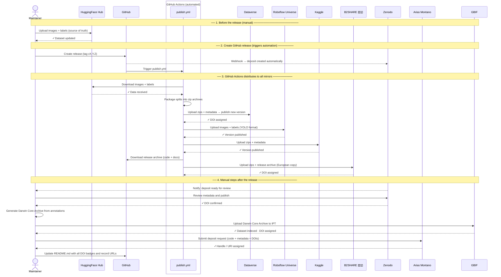

# Publishing Guide

This document explains how to publish and keep DonaDataset synchronized across all external
repositories. It is aimed at the **dataset maintainer**.

---

## Overview

To maximise the visibility, accessibility, and long-term preservation of DonaDataset,
the dataset is published across multiple internationally recognised repositories. Each
platform serves a different community — from machine learning researchers to ecologists
and data managers — ensuring that DonaDataset can be found and cited regardless of the
field or tool a user works with.

Although there are many repositories available worldwide, the following have been selected
based on their relevance to the dataset's scope (biodiversity, computer vision, open
science), their alignment with the EU funding context of the WildINTEL project, and
their adoption by the international research community:

| Repository | Type | DOI | Audience |
|---|---|---|---|
| [HuggingFace Hub](#1-huggingface-hub) | Specialised (ML) | No | AI / ML community |
| [Zenodo](#2-zenodo) | Open science archive | Yes | Scientific community |
| [Dataverse](#3-dataverse) | Research data repository | Yes | Scientific community |
| [Arias Montano (UHU)](#4-arias-montano-university-of-huelva) | Institutional repository | Yes | University of Huelva |
| [Roboflow Universe](#5-roboflow-universe) | Specialised (CV / YOLO) | No | Computer vision community |
| [Kaggle Datasets](#6-kaggle-datasets) | Generalised (ML) | No | ML community |
| [GBIF](#7-gbif) | Biodiversity data | Yes | Ecology / biology community |
| [B2SHARE (EUDAT)](#8-b2share-eudat) | European research data | Yes | EU scientific community |

---

## What is stored where

DonaDataset is made up of the following types of content:

- **Images** — the raw camera-trap photographs captured in Doñana National Park.
  Large binary files that form the bulk of the dataset.

- **Labels** — one annotation file per image in YOLO format. Each row describes one
  annotated object using a class identifier and normalized bounding-box coordinates.

- **Species catalogue** — the file `metadata/classes.yaml`, which maps each numeric
  label identifier to the corresponding dataset label. The label space contains 16 object
  categories plus the `Empty` category used for negative examples.

- **Scripts** — Python utilities included in this repository: `download.py` to fetch
  the dataset, `upload.py` to publish new images to HuggingFace Hub, and `validate.py`
  to check dataset integrity.

- **Documentation** — the MkDocs site (this guide and related pages) and the
  `README.md`, which describe the dataset, its structure, and how to use it.

- **Occurrence records** — an optional representation of selected wildlife detections in
  [Darwin Core](https://dwc.tdwg.org/) format for GBIF. Only biologically meaningful
  wildlife detections should be exported as occurrence records.

Due to the nature of the different repositories — some specialised in large file storage,
others in citable scientific records or biodiversity standards — it is not always possible
to store images and metadata together in the same place. The table below shows what is
stored in each repository:

| Repository | Images | Labels | Species catalogue | Scripts | Documentation | Occurrence records |
|---|:---:|:---:|:---:|:---:|:---:|:---:|
| HuggingFace Hub | ✅ | ✅ | | | | |
| Dataverse | ✅ | ✅ | ✅ | | | |
| Roboflow Universe | ✅ | ✅ | | | | |
| Kaggle | ✅ | ✅ | ✅ | | | |
| B2SHARE (EUDAT) 🇪🇺 | ✅ | ✅ | ✅ | ✅ | ✅ | |
| Zenodo | | | ✅ | ✅ | ✅ | |
| Arias Montano (UHU) | | | ✅ | ✅ | ✅ | |
| GBIF | | | ✅ | | | ✅ |

---

## 1. HuggingFace Hub

**URL:** https://huggingface.co/datasets/wildintelproject/donadataset

HuggingFace Hub is the leading platform for sharing machine learning models and datasets.
It provides version control, a built-in dataset viewer, and a Python library for
programmatic access, making it the primary reference for the AI and machine learning
research community. It is used as the **primary source of truth** for DonaDataset images,
YOLO labels and dataset configuration files.

### First-time setup

1. Create an account at [huggingface.co](https://huggingface.co) and join the
   **wildintelproject** organisation.
2. Install the HuggingFace CLI:

   ```bash
   pip install huggingface-hub
   huggingface-cli login   # paste your access token
   ```

3. Create the dataset repository on the web:
   **New → Dataset → wildintelproject/donadataset** (set to Public, CC BY 4.0).

### Uploading the dataset

The DonaDataset directory should follow the DonaNet-compatible structure:

```text
dataset/
├── images/
│   ├── train/
│   ├── val/
│   └── test/
├── labels/
│   ├── train/
│   ├── val/
│   └── test/
├── data.yaml
└── annotations.csv
```

Upload the full `dataset/` directory to HuggingFace Hub:

```bash
huggingface-cli upload wildintelproject/donadataset ./dataset . \
  --repo-type dataset
```

This uploads:

```text
images/train/
images/val/
images/test/
labels/train/
labels/val/
labels/test/
data.yaml
annotations.csv
```

If only one split needs to be updated, upload both the images and labels for that split:

```bash
# Example: update train images
huggingface-cli upload wildintelproject/donadataset ./dataset/images/train images/train \
  --repo-type dataset

# Example: update train labels
huggingface-cli upload wildintelproject/donadataset ./dataset/labels/train labels/train \
  --repo-type dataset
```

After updating split files, upload the dataset configuration and annotation table if they changed:

```bash
huggingface-cli upload wildintelproject/donadataset ./dataset/data.yaml data.yaml \
  --repo-type dataset

huggingface-cli upload wildintelproject/donadataset ./dataset/annotations.csv annotations.csv \
  --repo-type dataset
```

### Updating the dataset card

The dataset card is the `README.md` inside the HuggingFace dataset repository, not the `README.md`
inside this GitHub repository.

Edit it directly on the HuggingFace web UI or push a `README.md` via the CLI:

```bash
huggingface-cli upload wildintelproject/donadataset ./README.md README.md \
  --repo-type dataset
```

### On every new version

1. Upload the new or updated dataset files to HuggingFace Hub.
2. Verify that the HuggingFace repository contains:

   ```text
   images/train/
   images/val/
   images/test/
   labels/train/
   labels/val/
   labels/test/
   data.yaml
   annotations.csv
   ```

3. Update the dataset card if the dataset version, class list, structure, licence or citation information changed.
4. Update `metadata/classes.yaml`, `metadata/dataset.yaml` and the documentation in this GitHub repository if splits, labels or class IDs changed.

---

## 2. Zenodo

**URL:** https://zenodo.org

Zenodo is an open-access repository operated by CERN. It enables researchers to archive and cite research outputs such as software, metadata, documentation and release snapshots. Zenodo assigns persistent DOIs and is widely used as a long-term scientific archive.

>  **What Zenodo hosts:** Zenodo archives the contents of **this GitHub repository**:
> documentation, metadata files, scripts and release information.
>
> The public image files and YOLO label files are **not stored in Zenodo**. They are hosted on
> HuggingFace Hub. The Zenodo record exists to provide a citable DOI for the DonaDataset release
> and to preserve the repository metadata and documentation.

### First-time setup — GitHub integration

1. Log in at [zenodo.org](https://zenodo.org) with your GitHub account.
2. Go to **Account → GitHub**.
3. Find **wildintelproject/donadataset** and toggle it **ON**.
4. Zenodo will watch this GitHub repository for new releases.

### Publishing a new version

1. In this GitHub repository, create a new release:
   **Releases → Draft a new release → Create tag**.
   Recommended tag format:
   ```text
   vMAJOR.MINOR.PATCH
   ```
   Example:
   ```text
   v1.1.0
   ```

2. Write release notes describing the dataset, metadata or documentation changes.
3. Publish the GitHub release.
4. Zenodo will automatically create a new deposit from the GitHub release.
5. Open the Zenodo deposit and review:
   - title;
   - authors;
   - description;
   - licence;
   - related identifiers;
   - links to HuggingFace Hub and the GitHub repository.
6. Publish the Zenodo deposit if it is not published automatically.
7. Copy the DOI badge URL and update it in `README.md` if needed:

   ```markdown
   [](https://doi.org/10.5281/zenodo.XXXXXXX)
   ```

> **Note:** The Zenodo description should clearly state that the actual image and YOLO label files are hosted on HuggingFace Hub. Zenodo preserves the GitHub repository snapshot, metadata, scripts and documentation.
---

## 3. Dataverse

**URL:** https://dataverse.harvard.edu (or another Dataverse instance if preferred)
Dataverse is an open-source research data repository platform originally developed by
Harvard University and now adopted by many institutions worldwide. It is designed for
sharing, citing and archiving research datasets, with support for rich metadata,
versioning and persistent identifiers such as DOIs.

> **What Dataverse hosts:** Dataverse acts as a mirror of the actual dataset files:
> images, YOLO label files, `data.yaml`, `annotations.csv` and selected metadata files.
> It is an alternative access point for researchers who prefer a traditional academic
> data repository.
> **File size limit:** Harvard Dataverse has a per-file size limit. If the full dataset is
> too large for a single upload, split the data by partition into `train.zip`, `val.zip`
> and `test.zip`.

### First-time setup

1. Create an account at [dataverse.harvard.edu](https://dataverse.harvard.edu).
2. Request access to or create a **Dataverse collection** for WildINTEL / University of Huelva.
3. Click **Add Data → New Dataset**.

### Filling in the metadata

| Field | Value |
|---|---|
| Title | DonaDataset: Camera-trap dataset from Doñana National Park |
| Author | WildINTEL project team |
| Contact | Project contact email |
| Description | Summary from `docs/dataset-description.md` |
| Subject | Earth and Environmental Sciences |
| Licence | CC BY 4.0 |
| Related publication | DOI of the associated paper, when available |
| Related dataset | HuggingFace Hub dataset URL |

### Preparing and uploading files

1. Package each split as a ZIP archive:

   ```bash
   mkdir -p dataverse_upload
   zip -r dataverse_upload/train.zip dataset/images/train dataset/labels/train
   zip -r dataverse_upload/val.zip dataset/images/val dataset/labels/val
   zip -r dataverse_upload/test.zip dataset/images/test dataset/labels/test
   cp dataset/data.yaml dataverse_upload/
   cp dataset/annotations.csv dataverse_upload/
   cp -r metadata dataverse_upload/
   ```

2. Upload the files through the Dataverse web UI.

3. Alternatively, use the Dataverse API:
   ```bash
   for split in train val test; do
     curl -H "X-Dataverse-key: $DATAVERSE_API_TOKEN" \
          -X POST \
          -F "file=@dataverse_upload/${split}.zip" \
          "https://dataverse.harvard.edu/api/datasets/:persistentId/add?persistentId=doi:10.7910/DVN/XXXXXX"
   done
   ```

4. Upload the supplementary files as well:
   ```bash
   curl -H "X-Dataverse-key: $DATAVERSE_API_TOKEN" \
        -X POST \
        -F "file=@dataverse_upload/data.yaml" \
        "https://dataverse.harvard.edu/api/datasets/:persistentId/add?persistentId=doi:10.7910/DVN/XXXXXX"
   curl -H "X-Dataverse-key: $DATAVERSE_API_TOKEN" \
        -X POST \
        -F "file=@dataverse_upload/annotations.csv" \
        "https://dataverse.harvard.edu/api/datasets/:persistentId/add?persistentId=doi:10.7910/DVN/XXXXXX"
   ```

### On every new version
1. Open the existing dataset on Dataverse.
2. Click **Edit Dataset → Add New Files**.
3. Upload the updated ZIP archives and supplementary files.
4. Review the metadata.
5. Increment the version number and click **Publish**.

---

## 4. Arias Montano, University of Huelva
**URL:** https://rabida.uhu.es

Arias Montano is the institutional open-access repository of the University of Huelva,
managed by the university library service. Its purpose is to preserve and give visibility
to the scientific output produced by the university's researchers, ensuring long-term
access and compliance with open-access mandates.

> **What Arias Montano hosts:** Arias Montano archives the contents of **this GitHub repository**:
> metadata, scripts and documentation.
> The public image files and YOLO label files are **not stored here**. They are hosted on
> HuggingFace Hub and, when available, mirrored on Dataverse. The Arias Montano deposit exists
> to provide an institutional citable record at the University of Huelva.

Deposits are made by request through the University of Huelva library service.

### Steps

1. Contact the **Biblioteca de la Universidad de Huelva** to open a deposit:
   - Web: [https://www.uhu.es/biblioteca/](https://www.uhu.es/biblioteca/)
   - Email: biblioteca@uhu.es
2. Provide the following information:
   - Title, authors and abstract in Spanish and English.
   - Licence: CC BY 4.0.
   - Type of resource: *Dataset*.
   - Links to HuggingFace Hub, Dataverse and Zenodo, when available.
   - Associated publication or project: WildINTEL / Biodiversa+.
3. The library will assign a permanent handle or URI and confirm the deposit.
4. Update `README.md` and the documentation by replacing the generic Arias Montano link with the specific record URL.

### On every new version
Contact the library again to add a new version record linked to the existing deposit.

---

## 5. Roboflow Universe

**URL:** https://universe.roboflow.com
Roboflow Universe is a community platform specialised in computer vision datasets. It
supports YOLO and other annotation formats natively, and provides tools to explore,
augment and version datasets. Its Python SDK allows integration into computer-vision
training pipelines.

> **What Roboflow hosts:** Roboflow can host a mirror of the DonaDataset image files and
> YOLO label files for the computer-vision community.
> The primary source of truth remains HuggingFace Hub. Roboflow should be treated as an
> optional mirror for users who prefer the Roboflow ecosystem.

### First-time setup
1. Create an account at [roboflow.com](https://roboflow.com) and create a workspace for
   **WildINTEL** or use an existing workspace.
2. Click **New Project → Object Detection**.
3. Set the project name to `donadataset`.
4. Set the licence to **CC BY 4.0**.
5. Set the annotation format to **YOLOv8**.

### Uploading images and labels
The local dataset must follow the DonaNet-compatible structure:
```text
dataset/
├── images/
│   ├── train/
│   ├── val/
│   └── test/
├── labels/
│   ├── train/
│   ├── val/
│   └── test/
├── data.yaml
└── annotations.csv
```

Install the Roboflow Python package:
```bash
pip install roboflow
```
Upload each split with its corresponding images and YOLO label files:
```python
from roboflow import Roboflow

rf = Roboflow(api_key="YOUR_API_KEY")
project = rf.workspace("wildintelproject").project("donadataset")

for split in ["train", "val", "test"]:
    project.upload(
        image_path=f"dataset/images/{split}",
        annotation_path=f"dataset/labels/{split}",
        split=split,
        num_workers=4,
    )
```

### On every new version
1. Upload the new or updated images and labels.
2. Create a new version in the Roboflow UI.
3. Review that the class list and split counts match `dataset/data.yaml`.
4. Update the Roboflow link in `README.md` or the documentation if needed.

---

## 6. Kaggle Datasets

**URL:** https://www.kaggle.com/datasets

Kaggle is a data science and machine learning platform owned by Google. Its dataset
repository offers high visibility within the ML community and integrates directly with
Kaggle Notebooks, allowing users to explore and use the data without local setup.

> **What Kaggle hosts:** Kaggle can host a mirror of the DonaDataset image files,
> YOLO label files, `data.yaml`, `annotations.csv` and selected metadata files.
> The primary source of truth remains HuggingFace Hub. Kaggle should be treated as an
> optional mirror for users who prefer the Kaggle ecosystem.

### First-time setup

1. Create an account at [kaggle.com](https://www.kaggle.com) and join or create the
   **wildintelproject** organisation.
2. Install the Kaggle CLI:
   ```bash
   pip install kaggle
   ```
3. Place your `kaggle.json` token in:
   ```text
   ~/.kaggle/kaggle.json
   ```
4. Create a `dataset-metadata.json` file in the project root:
   ```json
   {
     "title": "DonaDataset — Camera-trap dataset from Doñana",
     "id": "wildintelproject/donadataset",
     "licenses": [{"name": "CC-BY-4.0"}]
   }
   ```

### Uploading images and labels
Package each split with both images and YOLO label files:
```bash
mkdir -p kaggle_upload
zip -r kaggle_upload/train.zip dataset/images/train dataset/labels/train
zip -r kaggle_upload/val.zip dataset/images/val dataset/labels/val
zip -r kaggle_upload/test.zip dataset/images/test dataset/labels/test
cp dataset/data.yaml kaggle_upload/
cp dataset/annotations.csv kaggle_upload/
cp -r metadata kaggle_upload/
cp dataset-metadata.json kaggle_upload/
```

Create the dataset on first upload:
```bash
kaggle datasets create -p kaggle_upload/
```

For later updates, create a new dataset version:
```bash
kaggle datasets version -p kaggle_upload/ -m "v1.1.0 — description of changes"
```

### On every new version
1. Rebuild the ZIP archives from the current `dataset/` directory.
2. Check that each split archive contains both `images` and `labels`.
3. Check that `data.yaml` and `annotations.csv` are included when changed.
4. Run `kaggle datasets version` with a descriptive version message.

---

## 7. GBIF

**URL:** https://www.gbif.org
GBIF, the Global Biodiversity Information Facility, is an international open-access
infrastructure for biodiversity occurrence data. It is used by ecologists, conservation
biologists and environmental policy makers to discover and access species occurrence records.
> **What GBIF hosts:** GBIF can host biodiversity occurrence records derived from DonaDataset
> in [Darwin Core](https://dwc.tdwg.org/) format.
> GBIF does **not** host the raw camera-trap images or the YOLO `.txt` label files. The image
> files and YOLO labels are hosted on HuggingFace Hub and, when available, mirrored through
> other dataset repositories.

### Important scope note
Only biologically meaningful wildlife detections should be converted into GBIF occurrence records.
The following records should normally be excluded from the GBIF export:
- `Empty` images, because they do not represent species occurrences;
- `Homo sapiens`, because it is used in DonaDataset for humans and vehicles and is not suitable as a biodiversity occurrence record;
- vehicle-only detections, if present in the source annotations;
- uncertain or ambiguous detections that cannot be assigned to a valid taxon.
Bird records under `Ave` should only be exported to GBIF if they can be mapped to an accepted taxon or an agreed higher-level taxonomic category. If they cannot be reliably resolved, they should be excluded from the GBIF export.

### First-time setup
1. Create an account at [gbif.org](https://www.gbif.org).
2. Request an organisation account for WildINTEL or use the University of Huelva's existing GBIF publishing route.
3. Install or access a [GBIF IPT](https://www.gbif.org/ipt) instance.
4. Register the dataset in the IPT with an appropriate resource type for camera-trap-derived occurrence records.

### Preparing the Darwin Core data

Convert selected DonaDataset annotations to Darwin Core occurrence records.
Each exported detection should become one occurrence record with, at minimum, the following fields:
| Darwin Core field | Source |
|---|---|
| `scientificName` | Dataset label mapped through `metadata/classes.yaml` or another taxonomic mapping file |
| `eventDate` | Image metadata, EXIF timestamp or trusted source metadata |
| `decimalLatitude` / `decimalLongitude` | Camera location metadata |
| `basisOfRecord` | `MachineObservation` or another value accepted by the GBIF publishing workflow |
| `datasetName` | `DonaDataset` |
| `occurrenceID` | Stable unique identifier for the exported occurrence |
| `eventID` | Stable identifier for the camera-trap event or sequence, when available |
The export should preserve links back to the source dataset release and documentation where possible.

### Publishing
1. Generate a Darwin Core Archive (`.zip`) from the selected occurrence records.
2. Validate the Darwin Core Archive before publication.
3. Upload the archive to the IPT resource.
4. Register or update the resource with GBIF.
5. After GBIF indexing, update `README.md` and the documentation with the GBIF dataset link or DOI, if assigned.

### On every new version
1. Regenerate the Darwin Core Archive from the updated annotations.
2. Exclude records that are not suitable for biodiversity occurrence publishing.
3. Upload the new archive to the IPT resource.
4. Trigger or request a re-indexing through the GBIF publishing workflow.
5. Update repository links and release notes if the GBIF record changed.

---

## 8. B2SHARE (EUDAT)

**URL:** https://b2share.eudat.eu
B2SHARE is a research data sharing service provided by EUDAT, the European collaborative
data infrastructure. It offers long-term research data storage on European servers and is
therefore suitable for EU-funded projects and open-science data preservation.
> **What B2SHARE hosts:** B2SHARE can host a European copy of the DonaDataset release,
> including image archives, YOLO label files, `data.yaml`, `annotations.csv`, selected
> metadata files and a GitHub release archive containing code and documentation.
> The primary source of truth remains HuggingFace Hub. B2SHARE should be treated as a
> European preservation copy or mirror.
> **Storage limit:** B2SHARE records may have file-size or storage limits. If the dataset is
> too large for a single upload, package the data as split-specific ZIP archives:
> `train.zip`, `val.zip` and `test.zip`.

### First-time setup

1. Log in at [b2share.eudat.eu](https://b2share.eudat.eu) using your institutional account
   or ORCID.
2. Click **Upload → Create new record**.
3. Select or create the **WildINTEL** community, or use an appropriate biodiversity or
   research-data community.

### Filling in the metadata

| Field | Value |
|---|---|
| Title | DonaDataset: Camera-trap dataset from Doñana National Park |
| Authors | WildINTEL project team |
| Description | Summary from `docs/dataset-description.md` |
| Community | Biodiversity / WildINTEL |
| Licence | CC BY 4.0 |
| Funding | Biodiversa+ Joint Research Call 2022–2023 |
| Related identifiers | HuggingFace URL, GitHub repository, Zenodo DOI, Dataverse DOI and GBIF DOI, when available |

### Uploading files

Package each split with both images and YOLO label files:
```bash
mkdir -p b2share_upload
zip -r b2share_upload/train.zip dataset/images/train dataset/labels/train
zip -r b2share_upload/val.zip dataset/images/val dataset/labels/val
zip -r b2share_upload/test.zip dataset/images/test dataset/labels/test
```

Add the main dataset configuration and annotation files:
```bash
cp dataset/data.yaml b2share_upload/
cp dataset/annotations.csv b2share_upload/
```

Add repository metadata files:
```bash
cp -r metadata b2share_upload/
```

Add the GitHub release archive containing code and documentation:
```bash
curl -L https://github.com/wildintelproject/donadataset/archive/refs/tags/vX.Y.Z.zip \
     -o b2share_upload/donadataset-vX.Y.Z.zip
```
Then upload all files in `b2share_upload/` through the B2SHARE web UI.

### On every new version
1. Rebuild the ZIP archives from the current `dataset/` directory.
2. Check that each split archive contains both images and YOLO label files.
3. Include updated `data.yaml`, `annotations.csv` and metadata files.
4. Add the GitHub release archive for the same version tag.
5. Create a new B2SHARE record version and upload the updated files.
6. Update `README.md` and the documentation with the B2SHARE record URL or DOI, if available.
---

## Checklist for a new dataset release

**Images + labels (data mirrors)**
- [ ] Upload new images and labels to **HuggingFace Hub**.
- [ ] Upload updated zip archives to **Dataverse** and publish the new version.
- [ ] Upload updated images and labels to **Roboflow Universe** and create a new version.
- [ ] Upload updated zip archives to **Kaggle Datasets** (`kaggle datasets version`).

**Code + metadata (archive)**
- [ ] Update `metadata/classes.yaml` and `metadata/dataset.yaml` if needed.
- [ ] Create a **GitHub release** (triggers Zenodo automatically).
- [ ] Review and publish the **Zenodo** deposit; update the DOI badge in `README.md`.
- [ ] Notify **Arias Montano** library to register the new version.

**European copy — images + code (B2SHARE)**
- [ ] Upload updated zip archives + release archive to **B2SHARE** and publish the new version.

**Biodiversity records**
- [ ] Generate updated Darwin Core Archive and re-publish on **GBIF**.

**References**
- [ ] Update DOI badges and record URLs in `README.md`.
- [ ] Update the version number in `README.md` and `docs/dataset-description.md`.

---

## Publication workflow diagram

The following diagram shows the full sequence of steps to publish a new version of DonaDataset.



---

## Automating the publication of new versions

Almost the entire publication process can be automated. The only steps that require
manual intervention are uploading the images to HuggingFace Hub (the primary source),
reviewing the Zenodo deposit, publishing on GBIF, and notifying Arias Montano.

### What is automated vs. manual

| Step | How |
|---|---|
| HuggingFace Hub | ❌ Manual — run `scripts/upload.py` locally before the release |
| Dataverse | ✅ GitHub Actions (`publish.yml`) |
| Roboflow Universe | ✅ GitHub Actions (`publish.yml`) |
| Kaggle | ✅ GitHub Actions (`publish.yml`) |
| B2SHARE 🇪🇺 | ✅ GitHub Actions (`publish.yml`) |
| Zenodo | ✅ Automatic webhook triggered by the GitHub release |
| GBIF | ⚠️ Partial — Darwin Core Archive must be generated and uploaded manually |
| Arias Montano | ❌ Manual — contact biblioteca@uhu.es |

---

### Step 1 — Upload images to HuggingFace Hub (local)

Before creating the release, the maintainer must upload the new or updated images and
labels from their local machine. This is done with `scripts/upload.py`, which is included
in this repository:

```bash
# Set up the environment (first time only)
./setup.sh
source .venv/bin/activate

# Upload all splits to HuggingFace Hub
python scripts/upload.py

# Upload a single split
python scripts/upload.py --split train
```

The script reads the `HF_TOKEN` environment variable (or prompts for it) and pushes
the contents of `data/` to the HuggingFace Hub dataset repository.

> Make sure the images and labels follow the DonaNet-compatible structure:
> `dataset/images/train`, `dataset/images/val`, `dataset/images/test`,
> `dataset/labels/train`, `dataset/labels/val` and `dataset/labels/test`.

---

### Step 2 — Create a GitHub release (triggers automation)

Once the images are on HuggingFace Hub, create a new release in this GitHub repository:

1. Go to **Releases → Draft a new release**.
2. Create a new tag following [semantic versioning](https://semver.org/): `vX.Y.Z`.
3. Write a release description summarising the changes.
4. Click **Publish release**.

This single action triggers two things simultaneously:
- **Zenodo** automatically archives this repository and creates a new deposit.
- **GitHub Actions** runs `.github/workflows/publish.yml`.

---

### Step 3 — GitHub Actions distributes to all mirrors

The workflow `publish.yml` runs automatically on GitHub's servers. It:

1. Frees up disk space on the runner (~30 GB recovered).
2. Downloads the full dataset from **HuggingFace Hub**.
3. Packages each split into a zip archive (`train.zip`, `val.zip`, `test.zip`).
4. Uploads the archives to **Dataverse**, **Roboflow Universe**, **Kaggle**, and **B2SHARE**.
5. Writes a summary in the GitHub release page listing completed and pending steps.

If any individual mirror upload fails, the others continue — each step uses
`continue-on-error: true`.

> ⚠️ **Disk space:** the `ubuntu-latest` runner has ~14 GB free by default. The workflow
> recovers extra space at startup. If the dataset exceeds available disk, consider using
> a larger GitHub runner (paid, up to 64 GB) or uploading splits in separate jobs.

---

### Step 4 — Configure GitHub Secrets (one-time setup)

Before using the workflow for the first time, add the following secrets in the repository:
**Settings → Secrets and variables → Actions → New repository secret**

| Secret | Platform | How to obtain |
|---|---|---|
| `HF_TOKEN` | HuggingFace Hub | huggingface.co → Settings → Access Tokens |
| `DATAVERSE_API_TOKEN` | Dataverse | dataverse.harvard.edu → Account → API Token |
| `DATAVERSE_DOI` | Dataverse | Persistent ID of the dataset, e.g. `doi:10.7910/DVN/XXXXXX` |
| `ROBOFLOW_API_KEY` | Roboflow | roboflow.com → Settings → Roboflow API |
| `ROBOFLOW_WORKSPACE` | Roboflow | Workspace slug, e.g. `wildintelproject` |
| `ROBOFLOW_PROJECT` | Roboflow | Project slug, e.g. `donadataset` |
| `KAGGLE_USERNAME` | Kaggle | kaggle.com → Settings → API |
| `KAGGLE_KEY` | Kaggle | kaggle.com → Settings → API |
| `B2SHARE_API_TOKEN` | B2SHARE | b2share.eudat.eu → Account → Personal access tokens |
| `B2SHARE_BUCKET_ID` | B2SHARE | File bucket ID from the record's JSON (`links.files`) |