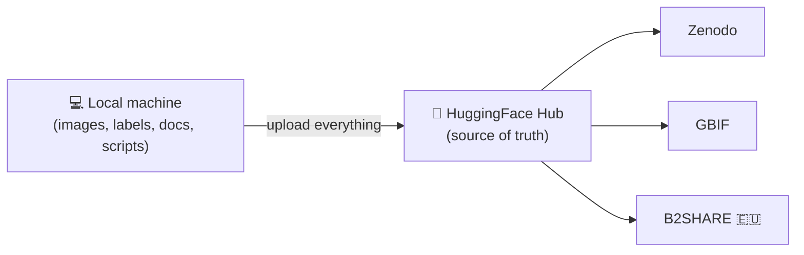
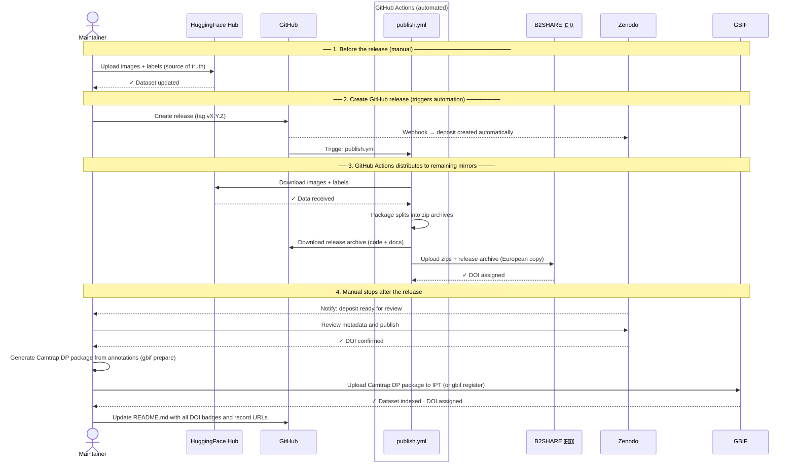

# Publishing Guide

This document explains how to publish and keep DonaDataset synchronized across all external
repositories. It is aimed at the **dataset maintainer**.

---

## Overview

To maximise the visibility, accessibility, and long-term preservation of DonaDataset,
the dataset is published across multiple internationally recognised repositories. Each
platform serves a different community — from machine learning researchers to ecologists
and data managers — ensuring that DonaDataset can be found and cited regardless of the
field or tool a user works with.

Everything starts on the maintainer's local machine and is uploaded to **HuggingFace
Hub**, which acts as the single source of truth. From there, the dataset (or the parts
of it relevant to each platform — see [What is stored where](#what-is-stored-where)) is
published out to the other repositories:



Although there are many repositories available worldwide, the following have been selected
based on their relevance to the dataset's scope (biodiversity, computer vision, open
science), their alignment with the EU funding context of the WildINTEL project, and
their adoption by the international research community:

<table>
<thead>
<tr><th>Repository</th><th>Type</th><th>DOI</th><th>Audience</th><th>Implementation status</th></tr>
</thead>
<tbody>
<tr><td><a href="../publishing-huggingface/">HuggingFace Hub</a></td><td>Specialised (ML)</td><td>Yes</td><td>AI / ML community</td><td>Testing</td></tr>
<tr><td><a href="../publishing-zenodo/">Zenodo</a></td><td>Open science archive</td><td>Yes</td><td>Scientific community</td><td>Testing</td></tr>
<tr><td><a href="../publishing-gbif/">GBIF</a></td><td>Biodiversity data</td><td>Yes</td><td>Ecology / biology community</td><td>Testing</td></tr>
<tr><td><a href="../publishing-b2share/">B2SHARE (EUDAT)</a></td><td>European research data</td><td>Yes</td><td>EU scientific community</td><td>Testing</td></tr>
<tr class="status-planned"><td>Dataverse</td><td>Research data repository</td><td>Yes</td><td>Scientific community</td><td>Under consideration</td></tr>
<tr class="status-planned"><td>Arias Montano (UHU)</td><td>Institutional repository</td><td>Yes</td><td>University of Huelva</td><td>Under consideration</td></tr>
<tr class="status-planned"><td>Roboflow Universe</td><td>Specialised (CV / YOLO)</td><td>No</td><td>Computer vision community</td><td>Under consideration</td></tr>
<tr class="status-planned"><td>Kaggle Datasets</td><td>Generalised (ML)</td><td>Yes</td><td>ML community</td><td>Under consideration</td></tr>
</tbody>
</table>

---

## What is stored where

DonaDataset is made up of the following types of content:

- **Images + Labels** — the raw camera-trap photographs captured in Doñana National
  Park (large binary files that form the bulk of the dataset), together with one YOLO
  annotation file per image (species class identifier, bounding box coordinates,
  confidence score) that turns those raw photographs into a supervised training
  dataset. Some repositories host these files directly (✅); others deliberately don't
  and instead link back to where they actually live on HuggingFace Hub (🔗) — e.g.
  Zenodo's `related_identifiers`, B2SHARE's `alternate_identifier`, or GBIF's
  `media.filePath`, which always links back this way.

- **Species catalogue** — the file `metadata/classes.yaml`, which maps each numeric
  class identifier to the common and scientific name of the corresponding mammal species.
  It is the key that makes labels human-readable and scientifically meaningful.

- **Scripts** — Python utilities included in this repository: `download.py` to fetch
  the dataset, `upload.py` to publish new images to HuggingFace Hub, and `validate.py`
  to check dataset integrity.

- **Documentation** — the MkDocs site (this guide and related pages) and the
  `README.md`, which describe the dataset, its structure, and how to use it.

- **Camtrap DP package** — a representation of the dataset in
  [Camtrap DP](https://camtrap-dp.tdwg.org/) format for GBIF. Each detected animal
  becomes an observation with species name, date, and deployment location, making the
  data discoverable by ecologists and conservation researchers worldwide.

Due to the nature of the different repositories — some specialised in large file storage,
others in citable scientific records or biodiversity standards — it is not always possible
to store images and metadata together in the same place. The table below shows what is
stored in each repository:

| Repository | Images + Labels | Species catalogue | Scripts | Documentation | Camtrap DP package |
|---|:---:|:---:|:---:|:---:|:---:|
| GitHub repository | 🔗 | ✅ | ✅ | ✅ | |
| HuggingFace Hub | ✅ | ✅ | | | |
| Zenodo | 🔗 | ✅ | | | |
| GBIF | 🔗 | ✅ | | | ✅ |
| B2SHARE (EUDAT) 🇪🇺 | 🔗 | ✅ | | | |

> ℹ️ On **HuggingFace Hub**, images and labels aren't uploaded as loose files — they're
> packaged together inside `.tar` shards (`data/<split>/*.tar`), each one bundling
> matching `images/<split>/...` and `labels/<split>/...` files for a batch of the
> dataset. See
> [publishing-huggingface.md](publishing-huggingface.md#4-how-we-upload-it-every-file-explained)
> for the full breakdown of what's inside a shard.

---

## Generating the dataset

Before anything can be published anywhere, the raw annotated source has to be turned
into the clean, split YOLO dataset that every publishing path reads from:

```bash
donadataset generate real
```

### What it expects as input

- `--source` (default `GENERATE.source`, `<Documents>/donadataset/source`) — the raw
  camera-trap dataset, **already split** into `images/<train,val,test>/` and
  `labels/<train,val,test>/`. `generate real` does not split anything itself; the
  splits have to already exist in the source.
- `--classes-map` (default `metadata/source_classes.yaml`) — a flat `id: name` YAML
  mapping of the **source** dataset's own original class scheme (18 classes, ids 0–17
  today). This is the upstream annotation scheme, not the project's own public
  `metadata/classes.yaml`.
- One YOLO `.txt` label per image, at the same relative path under `labels/<split>/` —
  images without a matching label are dropped and counted separately in the summary.

> 💡 [`examples/source_dataset`](https://github.com/wildintelproject/donadataset/tree/main/examples/source_dataset)
> in this repository is a small mock dataset laid out exactly like this, deliberately
> covering every branch of the pipeline below (a dropped class, a missing label, a
> duplicate image under two extensions, a mixed kept/removed label, and plain
> pass-through images) — see its own `README.md` for the full breakdown of what each
> file exercises, and a ready-to-run command to try it.

### What it does

- Drops every image whose label contains any of `--remove-class-id` (default `10, 17`
  — Homo sapiens and Vehicle in the source scheme) entirely.
- Remaps the remaining old class ids to new, consecutive ids (closing the gaps left by
  the removed classes) and rewrites every kept label file with the new ids.
- Detects and drops duplicate images within each split, per `--duplicate-key-mode`:
  `stem` (default — same filename, regardless of subdirectory) or `relative_stem`
  (same relative path only). When duplicates are found, one copy is kept, preferring
  whichever candidate has a label file.
- Prints a per-split summary (`total_images`, `duplicate_groups`,
  `duplicated_images_removed`, `kept_images`, `removed_images`, `missing_labels`,
  `removed_missing_labels`, plus a `total_control` consistency check) and the full
  old → new class id mapping — nothing is written to a report file, only printed to
  the console.

### What it generates as output

Writes to `--output` (default `GENERATE.output`, `<Documents>/donadataset/output` —
**emptied completely** before generating):

```
output/
├── images/<split>/...     ← kept images, same relative paths as the source
├── labels/<split>/...     ← remapped YOLO labels
└── donana_filtered.yaml   ← nc, names, and absolute image paths per split
```

This is exactly the `images/<split>/` + `labels/<split>/` layout that `donadataset
publish huggingface prepare`/`pipeline` (and, through it, `publish all`) expect at
`--source-dataset-dir` — see [Publishing map](#publishing-map) below.

> ℹ️ `donadataset generate toy` is a related but separate command: it doesn't touch the
> raw source at all, it *subsamples* an already-generated `generate real` output
> (capped per class, with a random seed) — useful for a fast local test run, not part
> of the publishing path.

---

## Publishing map

**[HuggingFace Hub](publishing-huggingface.md)**

The primary source of truth — the only platform storing the actual images and YOLO
labels. Covers first-time account/token setup, every exported file explained, and the
full `prepare` → `upload` → `release` → DOI sync sequence (manual, non-interactive
`pipeline`, or interactive `wizard`).

**[Zenodo](publishing-zenodo.md)**

A linked dataset record that provides a citable, permanent DOI — metadata and evidence
only, the images and labels themselves stay on HuggingFace Hub. Covers first-time
account/token setup, every uploaded file explained, and the full sequence up to the
final, irreversible publish.

**[GBIF](publishing-gbif.md)**

Converts the dataset into a Camtrap DP package for the biodiversity/ecology community,
published either through a manual IPT upload or the scripted Registry API. Covers
first-time account setup, exactly what `gbif prepare` derives from the data vs. invents
as a placeholder, and both publishing paths.

**[B2SHARE (EUDAT)](publishing-b2share.md)** 🇪🇺

The European copy of the dataset's metadata and evidence, hosted entirely on EU
servers — the same linked-record pattern as Zenodo. Covers first-time
account/community/token setup, every uploaded file explained, and the full publishing
sequence.

---

## Checklist for a new dataset release

**Images + labels**
- [ ] Upload new images and labels to **HuggingFace Hub**.

**Code + metadata (archive)**
- [ ] Update `metadata/classes.yaml` and `metadata/dataset.yaml` if needed.
- [ ] Create a **GitHub release** (triggers Zenodo automatically).
- [ ] Review and publish the **Zenodo** deposit; update the DOI badge in `README.md`.

**European copy — images + code (B2SHARE)**
- [ ] Upload updated zip archives + release archive to **B2SHARE** and publish the new version.

**Biodiversity records**
- [ ] Generate an updated Camtrap DP package (`gbif prepare`) and re-publish on **GBIF**.

**References**
- [ ] Update DOI badges and record URLs in `README.md`.
- [ ] Update the version number in `README.md` and `docs/dataset-description.md`.

---

## Publication workflow diagram

The following diagram shows the full sequence of steps to publish a new version of DonaDataset.



---

## Automating the publication of new versions

Almost the entire publication process can be automated, in one of two independent
ways — they are not steps of the same pipeline, pick one:

- **Locally, with the `donadataset publish all` CLI** — needs the dataset and every
  integration's credentials ready beforehand (see [Prerequisites](#prerequisites)
  below); the command uploads to HuggingFace Hub itself as its first step, then
  continues to Zenodo, B2SHARE, and GBIF. Nothing needs to already be published
  anywhere before you run it.
- **Via GitHub Actions** — the opposite precondition on the data side: this workflow
  only *distributes* what's already on HuggingFace Hub, it never uploads to it. The
  dataset has to be pushed there manually first (Step 1 below); only then does creating
  a GitHub release trigger the rest.

Either way, the steps that still require manual intervention are the same: reviewing
the Zenodo deposit before it publishes, and publishing on GBIF.

### Prerequisites

Both options below need two things ready first:

1. **The dataset generated** — see [Generating the dataset](#generating-the-dataset)
   above for what `donadataset generate real` expects as input and produces as output.
2. **Credentials for every integration you're publishing to** — an access token
   (HuggingFace Hub, Zenodo, B2SHARE) or username/password (GBIF), each stored once via
   `donadataset publish <repo> config set token` (or the matching environment
   variable) — see the "First-time setup" section of the
   [HuggingFace Hub](publishing-huggingface.md#first-time-setup),
   [Zenodo](publishing-zenodo.md#first-time-setup),
   [B2SHARE](publishing-b2share.md#first-time-setup), and
   [GBIF](publishing-gbif.md#first-time-setup) guides. `publish all`/`pipeline` fail
   with a clear error naming whichever token is still missing, rather than getting
   partway through and stalling silently. GitHub Actions doesn't read any of this —
   it uses its own repository Secrets instead (Step 4 below).
3. **A git tag for this version.** `huggingface pipeline` (and `publish all` through
   it) auto-detects the version from git: if `HEAD` is exactly on a tag like `v1.1.0`
   when you run it, that tag (minus the `v`) becomes the published version in
   `dataset_info.json`/`CITATION.cff`; otherwise it's left as the placeholder
   `REPLACE_WITH_VERSION`, since neither `publish all` nor this call to `pipeline`
   passes an explicit `--version`. Tag it first: `git tag v1.1.0 && git push origin
   v1.1.0`. Option B needs the exact same tag too — Step 2 below creates the GitHub
   release based on it, rather than creating a new one inline.

### Option A: Locally, with `donadataset publish all`

The `donadataset` CLI can drive **HuggingFace Hub, Zenodo, B2SHARE, and GBIF** end to
end in one command, starting from the dataset generated above:

```bash
donadataset publish all
```

`publish all` itself takes no `--source-dataset-dir` flag — it delegates straight to
`huggingface pipeline`, which defaults to `GENERATE.output` (see above). If you
generated the dataset somewhere else, reconfigure that setting first rather than
trying to pass a path on the `publish all` command line.

It runs each integration's `pipeline` in the order they depend on each other
(HuggingFace Hub → Zenodo → B2SHARE → GBIF), reusing whatever you've already saved with
`donadataset publish <repo> config set ...` — no flags needed if every integration is
already configured. Zenodo's `sync-doi` step re-uploads to HuggingFace Hub by itself
right after reserving the DOI (only `CITATION.cff`, `README.md`, and the checksums file
— never the whole export), so no manual step is needed there; B2SHARE still needs one
explicit re-upload after it, since B2SHARE's own PID isn't reserved until after
publication. The **one** manual step left is unavoidable: HuggingFace Hub has no API to
generate its own DOI, so its pipeline still pauses once for you to click "Generate DOI"
on the web UI and press Enter.

Use `--include`/`--exclude` (comma-separated: `huggingface`, `zenodo`, `b2share`, `gbif`)
to skip repositories — `--exclude` removes them, `--include` always wins if a repository
ends up in both. `--dry-run` prints the exact commands it would run, in order, without
running any of them.

```bash
donadataset publish all --exclude b2share      # skip B2SHARE this time
donadataset publish all --dry-run              # preview the full plan first
```

### Option B: Via GitHub Actions

| Step | How |
|---|---|
| HuggingFace Hub | ❌ Manual — must already be uploaded before creating the release (Step 1 below) |
| Zenodo | ✅ Automatic webhook triggered by the GitHub release |
| B2SHARE 🇪🇺 | ✅ GitHub Actions (`publish.yml`) |
| GBIF | ⚠️ Partial — `gbif prepare` is scriptable, but uploading/publishing still needs either the IPT UI or `gbif register` run by hand |

---

#### Step 1 — Upload images to HuggingFace Hub (local, prerequisite)

Before creating the release, the maintainer must upload the new or updated images and
labels from their local machine, and make the repository public — the workflow below
only distributes from HuggingFace Hub, it does not populate it or publish it. Use the
same CLI wizard described in the [HuggingFace Hub guide](publishing-huggingface.md):

```bash
donadataset publish huggingface wizard
```

Walks through prepare → upload → make public → generate the DOI (manual, on the web) →
reflect it locally, asking for confirmation before the irreversible "make public" step.
See [publishing-huggingface.md](publishing-huggingface.md#5-commands-to-publish) for
the full walkthrough, including the non-interactive `pipeline` alternative and the
manual step-by-step commands.

---

#### Step 2 — Create a GitHub release (triggers automation)

Once the images are on HuggingFace Hub, tag the version and create the release **based
on that tag** in this GitHub repository:

1. Tag the commit and push the tag, following [semantic versioning](https://semver.org/):
   `git tag vX.Y.Z && git push origin vX.Y.Z`.
2. Go to **Releases → Draft a new release**.
3. Select the tag you just pushed (don't type a new one here — the release has to be
   built on the tag from step 1, the same one HuggingFace Hub's version metadata is
   based on).
4. Write a release description summarising the changes.
5. Click **Publish release**.

This single action triggers two things simultaneously:
- **Zenodo** automatically archives this repository and creates a new deposit.
- **GitHub Actions** runs `.github/workflows/publish.yml`.

---

#### Step 3 — GitHub Actions distributes to remaining mirrors

The workflow `publish.yml` runs automatically on GitHub's servers. It:

1. Frees up disk space on the runner (~30 GB recovered).
2. Downloads the full dataset from **HuggingFace Hub** (this is why Step 1 has to have
   happened already — there is nothing to download otherwise).
3. Packages each split into a zip archive (`train.zip`, `val.zip`, `test.zip`).
4. Uploads the archive to **B2SHARE**.
5. Writes a summary in the GitHub release page listing completed and pending steps.

If any individual mirror upload fails, the others continue — each step uses
`continue-on-error: true`.

> ⚠️ **Disk space:** the `ubuntu-latest` runner has ~14 GB free by default. The workflow
> recovers extra space at startup. If the dataset exceeds available disk, consider using
> a larger GitHub runner (paid, up to 64 GB) or uploading splits in separate jobs.

---

#### Step 4 — Configure GitHub Secrets (one-time setup)

Before using the workflow for the first time, add the following secrets in the repository:
**Settings → Secrets and variables → Actions → New repository secret**

| Secret | Platform | How to obtain |
|---|---|---|
| `HF_TOKEN` | HuggingFace Hub | huggingface.co → Settings → Access Tokens |
| `B2SHARE_API_TOKEN` | B2SHARE | b2share.eudat.eu → Account → Personal access tokens |
| `B2SHARE_BUCKET_ID` | B2SHARE | File bucket ID from the record's JSON (`links.files`) |