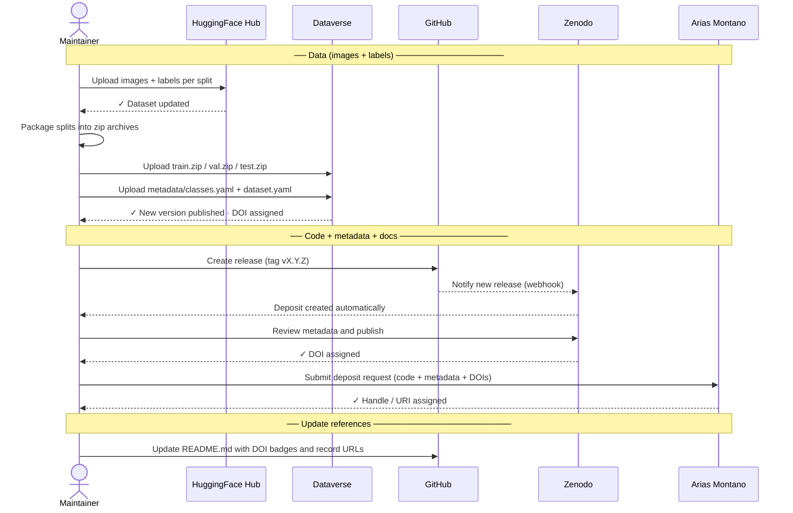

# Publishing Guide

This document explains how to publish and keep DonaDataset synchronized across all external
repositories. It is aimed at the **dataset maintainer**.

---

## Overview

| Repository | Type | DOI | Audience |
|---|---|---|---|
| [HuggingFace Hub](#1-huggingface-hub) | Specialised (ML) | No | AI / ML community |
| [Zenodo](#2-zenodo) | Open science archive | Yes | Scientific community |
| [Dataverse](#3-dataverse) | Research data repository | Yes | Scientific community |
| [Arias Montano (UHU)](#4-arias-montano-university-of-huelva) | Institutional repository | Yes | University of Huelva |

---

## What is stored where

| What | Where |
|---|---|
| **Images + labels** (the actual data) | HuggingFace Hub (primary) · Dataverse (mirror) |
| **Code + metadata + documentation** | This GitHub repository → archived in Zenodo (with DOI) · Arias Montano (UHU) |

---

## 1. HuggingFace Hub

**URL:** https://huggingface.co/datasets/wildintelproject/donadataset

### First-time setup

1. Create an account at [huggingface.co](https://huggingface.co) and join the
   **wildintelproject** organisation.
2. Install the HuggingFace CLI:
   ```bash
   pip install huggingface-hub
   huggingface-cli login   # paste your access token
   ```
3. Create the dataset repository on the web:
   **New → Dataset → wildintelproject/donadataset** (set to Public, CC BY 4.0).

### Uploading images and labels

```bash
# Upload a specific split (e.g. train)
huggingface-cli upload wildintelproject/donadataset ./data/train train \
  --repo-type dataset

# Upload all splits at once
for split in train val test; do
  huggingface-cli upload wildintelproject/donadataset ./data/$split $split \
    --repo-type dataset
done
```

### Updating the dataset card

The dataset card is the `README.md` inside the HuggingFace repository (not this GitHub repo).
Edit it directly on the HuggingFace web UI or push a `README.md` via the CLI.

### On every new version

1. Upload the new/updated images and labels as above.
2. Update the version tag in the dataset card.
3. Update `metadata/dataset.yaml` in this GitHub repo if splits or class IDs changed.

---

## 2. Zenodo

**URL:** https://zenodo.org

> ⚠️ **What Zenodo hosts:** Zenodo archives the contents of **this GitHub repository**
> (metadata, scripts, documentation). **The images and labels are NOT stored in Zenodo** —
> they live on HuggingFace Hub. The Zenodo deposit exists to provide a citable DOI for the
> dataset and to ensure long-term preservation of the code and metadata.

### First-time setup — GitHub integration (recommended)

1. Log in at [zenodo.org](https://zenodo.org) with your GitHub account.
2. Go to **Account → GitHub**.
3. Find **wildintelproject/donadataset** and toggle it **ON**.
4. Zenodo will now watch this repository for new releases.

### Publishing a new version

1. In this GitHub repository, create a new release:
   **Releases → Draft a new release → Create tag** (e.g. `v1.1.0`) → **Publish release**.
2. Zenodo automatically creates a new deposit and mints a DOI within a few minutes.
3. Go to the Zenodo deposit, review the metadata (title, authors, licence, description),
   and click **Publish** if it is not published automatically.
4. Copy the DOI badge URL and update it in `README.md`:
   ```markdown
   [](https://doi.org/10.5281/zenodo.XXXXXXX)
   ```

> **Note:** Zenodo archives the GitHub repository contents (code + metadata), not the images
> themselves (those live on HuggingFace). Include a clear note in the Zenodo description
> pointing to HuggingFace for the actual data files.

---

## 3. Dataverse

**URL:** https://dataverse.harvard.edu (or another Dataverse instance if preferred)

> 📦 **What Dataverse hosts:** Dataverse acts as a **mirror** of the actual dataset —
> images and labels — for the scientific community. It is the primary alternative to
> HuggingFace Hub for researchers who prefer a traditional academic data repository.
>
> ⚠️ **File size limit:** Harvard Dataverse has a **2.5 GB per-file** limit. Split the
> data by split (`train.zip`, `val.zip`, `test.zip`) before uploading to stay within
> this limit.

### First-time setup

1. Create an account at [dataverse.harvard.edu](https://dataverse.harvard.edu).
2. Request access to or create a **Dataverse collection** for WildINTEL / University of Huelva.
3. Click **Add Data → New Dataset**.

### Filling in the metadata

| Field | Value |
|---|---|
| Title | DonaDataset: Camera-trap mammal dataset from Doñana National Park |
| Author | WildINTEL project team |
| Contact | (project contact email) |
| Description | (copy from `docs/dataset-description.md`) |
| Subject | Earth and Environmental Sciences |
| Licence | CC BY 4.0 |
| Related publication | (add DOI of associated paper when available) |

### Preparing and uploading files

1. Package each split as a zip archive (max 2.5 GB per file):
   ```bash
   zip -r data/train.zip  data/train/
   zip -r data/val.zip    data/val/
   zip -r data/test.zip   data/test/
   ```
2. Upload via the web UI, or use the
   [Dataverse API](https://guides.dataverse.org/en/latest/api/native-api.html):
   ```bash
   for split in train val test; do
     curl -H "X-Dataverse-key: $DATAVERSE_API_TOKEN" \
          -X POST \
          -F "file=@data/${split}.zip" \
          "https://dataverse.harvard.edu/api/datasets/:persistentId/add?persistentId=doi:10.7910/DVN/XXXXXX"
   done
   ```
3. Also upload `metadata/classes.yaml` and `metadata/dataset.yaml` as supplementary files.

### On every new version

1. Open the existing dataset on Dataverse.
2. Click **Edit Dataset → Add New Files**, upload the updated zip archives.
3. Increment the version number and click **Publish**.

---

## 4. Arias Montano (University of Huelva)

**URL:** https://rabida.uhu.es

> 📦 **What Arias Montano hosts:** like Zenodo, Arias Montano archives the contents of
> **this GitHub repository** (metadata, scripts, documentation). **The images and labels
> are NOT stored here** — they live on HuggingFace Hub and Dataverse. The deposit exists
> to provide an institutional citable record at the University of Huelva.

Arias Montano is the institutional open-access repository of the University of Huelva,
managed by the university library service. Deposits are made by request.

### Steps

1. Contact the **Biblioteca de la Universidad de Huelva** to open a deposit:
   - Web: [https://www.uhu.es/biblioteca/](https://www.uhu.es/biblioteca/)
   - Email: biblioteca@uhu.es
2. Provide the following information:
   - Title, authors, abstract (in Spanish and English).
   - Licence: CC BY 4.0.
   - Type of resource: *Dataset*.
   - Links to HuggingFace Hub, Dataverse, and Zenodo (DOI).
   - Associated publication or project (WildINTEL / Biodiversa+).
3. The library will assign a permanent handle/URI and confirm the deposit.
4. Update `README.md` replacing the generic Arias Montano link with the specific record URL.

### On every new version

Contact the library again to add a new version record linked to the existing deposit.

---

## Checklist for a new dataset release

- [ ] Upload new images and labels to **HuggingFace Hub**.
- [ ] Update `metadata/classes.yaml` and `metadata/dataset.yaml` if needed.
- [ ] Upload updated zip archives (`train.zip`, `val.zip`, `test.zip`) to **Dataverse** and publish the new version.
- [ ] Create a **GitHub release** (triggers Zenodo automatically).
- [ ] Review and publish the **Zenodo** deposit; update the DOI badge in `README.md`.
- [ ] Notify **Arias Montano** library to register the new version.
- [ ] Update the version number in `README.md` and `docs/dataset-description.md`.

---

## Publication workflow diagram

The following diagram shows the full sequence of steps to publish a new version of DonaDataset.

