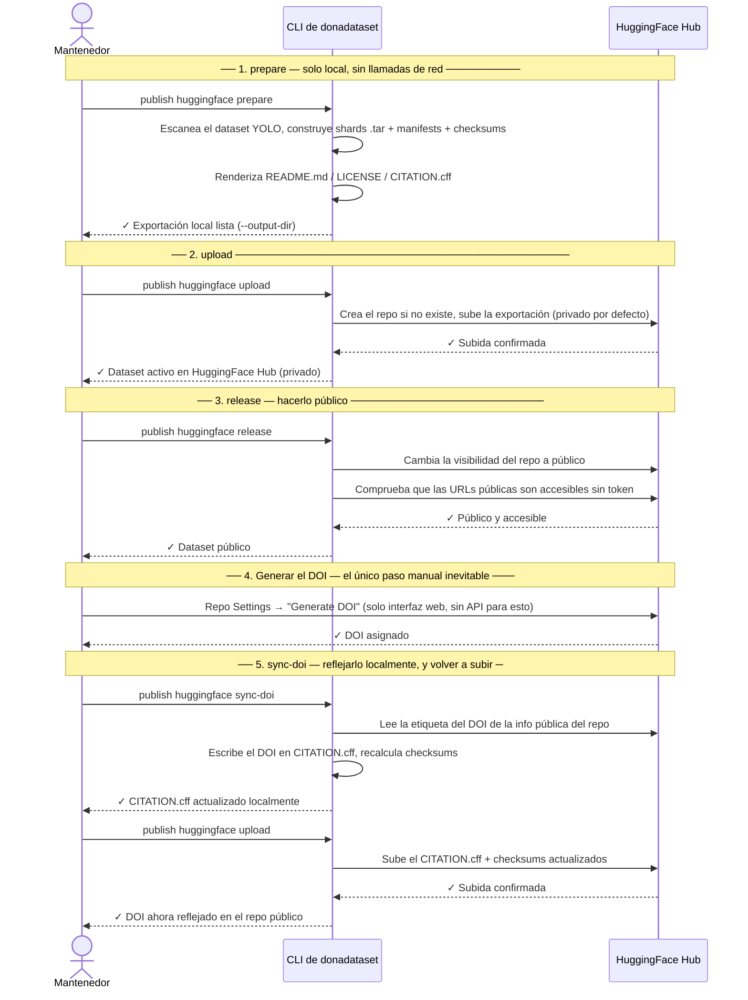

# Publicar en HuggingFace Hub

Esta guía explica cómo se publica DonaDataset en **HuggingFace Hub** usando la CLI de
`donadataset`. Está dirigida al **mantenedor del dataset**.

---

## 1. Qué es HuggingFace Hub

[HuggingFace Hub](https://huggingface.co) es la plataforma líder para compartir modelos
y datasets de machine learning. Proporciona:

- Versionado basado en git para cada repositorio (datasets incluidos).
- Un visor de datasets integrado, para que cualquiera pueda explorar imágenes/etiquetas
  sin descargar nada.
- Una librería Python (`huggingface_hub`) para subida/descarga programática, usada
  directamente por la CLI de este proyecto.
- Visibilidad pública o privada por repositorio, cambiable en cualquier momento.

En el pipeline de publicación de DonaDataset, HuggingFace Hub es la **fuente de verdad
principal** para los datos reales — es la única plataforma que almacena las imágenes y
las etiquetas YOLO en sí.

## 2. Qué permite subir HuggingFace Hub

A diferencia de Zenodo (solo metadatos en nuestro flujo — ver la
[guía de Zenodo](publishing-zenodo.md)), un **repositorio dataset** de HuggingFace
puede contener **cualquier fichero, de cualquier tamaño**: los datos binarios pesados
(imágenes, shards empaquetados) junto con pequeños ficheros de metadatos/documentación,
todo en el mismo repositorio, todo versionado por git. Aquí no hay separación entre
plataformas de "datos" y de "metadatos" — todo vive en un mismo sitio.

## 3. Qué subimos

`donadataset publish huggingface prepare` construye localmente una **carpeta de
exportación** autocontenida, y `donadataset publish huggingface upload` sube *toda* la
carpeta al repositorio de HuggingFace — no se sube nada de fuera de esa carpeta, y no
se omite nada dentro de ella (salvo ficheros basura de editor/SO como `*.tmp`, `*.bak`,
`__pycache__/`).

Esa carpeta contiene dos tipos de contenido:

- **Los datos en sí** — cada imagen y su etiqueta YOLO, empaquetadas en shards `.tar`,
  un conjunto de shards por partición (`train`/`val`/`test`).
- **Metadatos y documentación** — ficheros pequeños que describen el dataset, su
  integridad (checksums), su licencia, y cómo citarlo.

## 4. Cómo lo subimos — cada fichero explicado

### Los shards de datos

```
data/
├── train/
│   └── donadataset-train-00000.tar
├── val/
│   └── donadataset-val-00000.tar
└── test/
    └── donadataset-test-00000.tar
```

Cada shard `.tar` agrupa un lote de imágenes y sus etiquetas correspondientes para una
partición (se inician nuevos shards automáticamente al alcanzar
`sharding.max_shard_size_gb` — 2 GB por defecto). Dentro de un shard, las rutas se
mantienen compatibles con YOLO:

```
images/train/example.jpg
labels/train/example.txt
```

de modo que extraer todos los shards en un mismo directorio reconstruye un dataset YOLO
normal — sin necesidad de renombrar ni reestructurar nada tras la descarga.

### `donana.yaml`

El fichero de configuración de dataset Ultralytics/YOLO: rutas relativas a
`images/train`, `images/val`, `images/test`, más `nc` (número de clases) y `names`
(id de clase → nombre de especie). Es el fichero al que apuntas una ejecución de
entrenamiento YOLO.

### `dataset_info.json`

Un resumen legible por máquina de toda la exportación: nombre/slug/versión del dataset,
tipo de tarea, formato de anotación, recuentos totales de imágenes/etiquetas, el mapa de
clases, y — por partición — recuento de imágenes, recuento de etiquetas, número de
shards, y la lista de ficheros de shard. Útil para scripts que necesitan estadísticas
del dataset sin tener que parsear cada manifest.

### `manifest.csv`

Una fila por imagen, con todo lo necesario para rastrearla hasta su fichero y shard
original: `image_id`, `split`, `image_path`, `label_path`, `shard`, tamaños en bytes,
hashes SHA-256 de la imagen y la etiqueta, recuento de objetos, y los ids/nombres de
clase presentes en esa imagen.

### `manifest-files-sha256.csv`

La misma información que `manifest.csv`, pero aplanada a una fila **por fichero**
(imagen y etiqueta como filas separadas) con `file_type`, `relative_path`, `sha256`,
`size_bytes`, y `shard` — el formato más conveniente para scriptar una comparación de
checksums fichero a fichero.

### `metadata.csv`

Una versión más ligera de `manifest.csv` sin tamaños de fichero ni hashes — solo
`image_id`/`split`/`image_path`/`label_path`/`shard`/`num_objects`/clases presentes.
Pensado para exploración rápida del dataset (p. ej. cargarlo en pandas) sin las columnas
extra.

### `checksums-sha256.txt`

Una lista plana `sha256  relative/path` (mismo formato que `sha256sum`) que cubre los
propios shards y los ficheros de metadatos/documentación listados aquí. Esto es lo que
`huggingface download` recalcula y compara tras la descarga, para probar que el viaje de
ida y vuelta por HuggingFace Hub no corrompió ni truncó nada.

### `validation_report.json`

El resultado de validar el dataset YOLO **fuente** antes de empaquetarlo (ids de clase
dentro de rango, coordenadas normalizadas, sin etiquetas huérfanas, etc.) — los
problemas encontrados aquí ya habrían detenido `prepare` antes de escribir ningún shard,
así que en una exportación exitosa este fichero registra "sin errores".

### `verification_report_local.json`

El resultado de que `prepare` verifique su **propia salida** justo después de
escribirla: checksums globales recalculados y comparados, y cada fichero dentro de cada
shard `.tar` hasheado y comparado contra `manifest-files-sha256.csv`. `status:
"passed"` aquí es lo que demuestra que la exportación en sí es internamente
consistente, antes de subir nada a ningún sitio.

### `README.md`

La **dataset card** — la página que HuggingFace Hub renderiza en
`https://huggingface.co/datasets/<repo_id>`. Empieza con un bloque de frontmatter YAML
(`license`, `task_categories`, `pretty_name`) que HuggingFace parsea para rellenar la
tarjeta de información lateral, seguido de una descripción legible: formato del
dataset, particiones, lista de clases, cómo extraer los shards, un ejemplo de
entrenamiento, la licencia, y un puntero de cita — más, a juego con el propio README de
GitHub de este proyecto, badges de WildINTEL/licencia, una sección de
**Contribución**, y una sección de **Financiación** (WildINTEL / Biodiversa+). Generado
a partir de la plantilla Jinja2 `templates/hfh/README.md.j2` — edita ese fichero
directamente para cambiar cualquier texto, sin necesidad de tocar Python.

### `LICENSE`

La licencia en texto plano (nombre, identificador y URL — CC BY 4.0 por defecto).
Generado a partir de `templates/hfh/LICENSE.j2`, igual que `README.md`.

### `CITATION.cff`

Un fichero [Citation File Format](https://citation-cff.org/), para que herramientas
como GitHub y HuggingFace puedan ofrecer una cita ya preparada. Incluye título,
versión, fecha de release, licencia, la URL del artefacto del repositorio (este
repositorio de HuggingFace), y el/los autor(es) (`given-names`/`family-names`/
`affiliation`). Generado a partir de `templates/hfh/CITATION.cff.j2`, igual que
`README.md`/`LICENSE` — `repository-code`/`repository-artifact`/`doi` se omiten por
completo del fichero cuando están vacíos, en vez de escribirse como campos en blanco.

### `HuggingFaceHub.yaml`

Una instantánea congelada de la configuración que usó `prepare` para construir esta
exportación (la plantilla Jinja2 incluida, renderizada con tus flags/valores de
`settings.toml` en ese momento). Los comandos posteriores (`upload`, `download`,
`release`, `sync-doi`) leen este fichero por su nombre constante — ninguno de ellos
acepta un flag `--config`, todos lo localizan automáticamente a partir de
`--output-dir`. Zenodo y B2SHARE también lo descargan de nuevo del repositorio
publicado, como uno de los ficheros de evidencia incluidos en sus propios depósitos
(ver la
[guía de Zenodo](publishing-zenodo.md#4-como-lo-subimos-cada-fichero-explicado)) — este
fichero en sí no contiene nada específico de Zenodo/B2SHARE, es solo evidencia útil de
qué construyó la exportación que citan.

## 5. Comandos para publicar

### Configuración inicial

1. Crea una cuenta en [huggingface.co](https://huggingface.co) y únete a la
   organización **wildintelproject**.
2. Configura el propio entorno del proyecto (no el `huggingface-cli` en crudo):
   ```bash
   ./setup.sh
   source .venv/bin/activate
   ```
3. Consigue un token de acceso con permiso de escritura en
   [huggingface.co/settings/tokens](https://huggingface.co/settings/tokens), y
   configúralo como `HF_TOKEN`, o guárdalo una vez mediante `donadataset publish
   huggingface config set token`.
4. Configura `repo_id` (p. ej. `wildintelproject/donadataset`) mediante `donadataset
   publish huggingface config set repo_id=wildintelproject/donadataset` — el
   repositorio se crea automáticamente en la primera subida si aún no existe.

### La secuencia completa, visualmente



`wizard` (abajo) recorre exactamente esta secuencia de forma interactiva, una fase cada
vez, y cierra el bucle del paso 5 automáticamente (la re-subida final). `pipeline`
ejecuta las mismas cinco fases de forma no interactiva, pausándose solo en el paso 4
porque no hay API para ello.

### La forma fácil: `wizard`

```bash
donadataset publish huggingface wizard
```

Te guía por todo el proceso de forma interactiva, una fase cada vez: preparar, subir,
hacer público, generar el DOI, reflejarlo localmente. A diferencia de `pipeline`
(abajo):

- Pide `--repo-id` si todavía no has configurado uno, y ofrece guardarlo para no
  volver a preguntarlo.
- Detecta una exportación existente en `--output-dir` y pregunta si reutilizarla o
  regenerarla desde cero, en vez de empezar siempre de nuevo.
- Pide confirmación explícita antes de hacer **público** el dataset — el único paso
  difícil de deshacer del todo.
- Comprueba si ya se generó un DOI en una ejecución anterior antes de mostrar las
  instrucciones manuales de "ve a generarlo en la web", para no pedirte que repitas un
  paso que ya hiciste.
- Si algún paso falla (fallo de red, error transitorio de la API...), te deja
  reintentarlo, saltarlo o abortar — en vez de simplemente salir.
- Vuelve a subir automáticamente tras `sync-doi`, para que el `CITATION.cff`
  actualizado con el DOI llegue de verdad al repo público (la secuencia manual de
  comandos de abajo deja eso como un paso separado que tienes que recordar).

La identidad del dataset (nombre, licencia, autor...) no se pregunta aquí — viene de
`donadataset publish huggingface config set <campo>=...` (ver abajo), igual que
cualquier otro comando.

### La forma manual: paso a paso

```bash
# 1. Generar el dataset YOLO limpio a partir de los datos fuente en bruto
donadataset generate real --source <raw-dataset-dir> --output <clean-dataset-dir>

# 2. Construir la carpeta de exportación descrita arriba (shards + metadatos)
donadataset publish huggingface prepare \
  --source-dataset-dir <clean-dataset-dir> \
  --output-dir <export-dir> \
  --repo-id <tu-usuario>/<dataset-slug>

# 3. Subir la carpeta de exportación a HuggingFace Hub (el repo empieza privado)
export HF_TOKEN='hf_xxxxxxxxxxxxxxxxxxxxxxxxx'   # necesita acceso de escritura
donadataset publish huggingface upload

# 4. Volver a descargarlo y verificar el viaje de ida y vuelta (checksums, interior de los tar)
donadataset publish huggingface download

# 5. Hacer público el repositorio, y verificar que es accesible sin token
donadataset publish huggingface release
```

Tras el paso 5, opcionalmente puedes generar un DOI para el propio repositorio del
dataset — haz clic en **"Generate DOI"** en la página de Settings del repo en
huggingface.co (HuggingFace Hub no permite disparar esto vía API, solo a través de la
interfaz web). Una vez generado:

```bash
# 6. Detectar el DOI que asignó HuggingFace y escribirlo en CITATION.cff localmente
donadataset publish huggingface sync-doi

# 7. Volver a subir para que se publique el CITATION.cff actualizado
donadataset publish huggingface upload
```

Si además estás citando un registro de metadatos alojado en Zenodo (un DOI distinto y
complementario — ver la [guía de Zenodo](publishing-zenodo.md)), `sync-doi` no lo
sobrescribirá: el DOI de HuggingFace se añade a la lista `identifiers` de
`CITATION.cff` junto a él, en vez de reemplazar el campo principal `doi`.

No existe ningún flag `--config`: `prepare` siempre renderiza la única plantilla Jinja2
incluida (`templates/hfh/HuggingFaceHub.yaml.j2`) usando los flags mostrados arriba,
cuyos valores por defecto vienen de la sección `HUGGINGFACE` de `settings.toml` —
configúralos una vez con `donadataset publish huggingface config set <campo>=...` (o
`config wizard`) y evita repetir `--repo-id`/`--license-id`/etc. en cada ejecución. Los
pasos 3–7 tampoco aceptan `--config` — lo derivan de `--output-dir` (el mismo
directorio en el que escribió `prepare`). El contenido textual de `README.md`,
`LICENSE` y `CITATION.cff` se genera a su vez a partir de tres plantillas más en esa
misma carpeta (`templates/hfh/README.md.j2`, `templates/hfh/LICENSE.j2`,
`templates/hfh/CITATION.cff.j2`) — edítalas directamente para cambiar el texto sin
tocar ningún código Python.

`HF_TOKEN` tampoco hace falta exportarla en cada sesión: siempre gana si está
definida, pero si no lo está, `upload`/`download`/`release`/`sync-doi`/`wizard`
recurren a `huggingface.token` en `settings.toml` — guárdalo una vez con `donadataset
publish huggingface config set token` (entrada oculta, nunca se muestra en pantalla ni
la enseña `config show`, que imprime `••••••••` en su lugar).

Si además vas a publicar un registro enlazado en Zenodo (recomendado, para un DOI
permanente), el orden completo — incluyendo dónde encajan `zenodo
prepare`/`upload`/`release` respecto a estos cinco pasos — está en la
[guía de Zenodo](publishing-zenodo.md#5-comandos-para-publicar).
