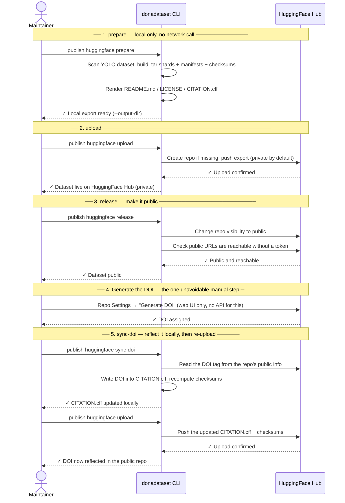

# Publishing to HuggingFace Hub

This guide explains how DonaDataset is published to **HuggingFace Hub** using the
`donadataset` CLI. It is aimed at the **dataset maintainer**.

---

## 1. What is HuggingFace Hub

[HuggingFace Hub](https://huggingface.co) is the leading platform for sharing machine
learning models and datasets. It provides:

- Git-based versioning for every repository (datasets included).
- A built-in dataset viewer, so anyone can browse images/labels without downloading anything.
- A Python library (`huggingface_hub`) for programmatic upload/download, used directly by
  this project's CLI.
- Public or private visibility per repository, switchable at any time.

In the DonaDataset publishing pipeline, HuggingFace Hub is the **primary source of truth**
for the actual data — it is the only platform that stores the images and YOLO labels
themselves.

## 2. What HuggingFace Hub allows uploading

Unlike Zenodo (metadata-only in our workflow — see the
[Zenodo guide](publishing-zenodo.md)), a HuggingFace **dataset repository** can hold
**any file, of any size**: the heavy binary data (images, packaged shards) together with
small metadata/documentation files, all in the same repository, all versioned by git.
There is no split between "data" and "metadata" platforms here — everything lives in one
place.

## 3. What we upload

`donadataset publish huggingface prepare` builds a self-contained **export folder**
locally, and `donadataset publish huggingface upload` pushes the *entire* folder to the
HuggingFace repository — nothing is uploaded from outside this folder, and nothing inside
it is skipped (other than editor/OS junk files like `*.tmp`, `*.bak`, `__pycache__/`).

That folder contains two kinds of content:

- **The data itself** — every image and its YOLO label, packaged into `.tar` shards, one
  set of shards per split (`train`/`val`/`test`).
- **Metadata and documentation** — small files describing the dataset, its integrity
  (checksums), its license, and how to cite it.

## 4. How we upload it — every file, explained

### The data shards

```
data/
├── train/
│   └── donadataset-train-00000.tar
├── val/
│   └── donadataset-val-00000.tar
└── test/
    └── donadataset-test-00000.tar
```

Each `.tar` shard bundles a batch of images and their matching labels for one split
(new shards are started automatically once `sharding.max_shard_size_gb` — 2 GB by
default — is reached). Inside a shard, paths are kept YOLO-compatible:

```
images/train/example.jpg
labels/train/example.txt
```

so that extracting all shards into one directory reconstructs a normal YOLO dataset —
no renaming or restructuring needed after download.

### `donana.yaml`

The Ultralytics/YOLO dataset configuration file: relative paths to `images/train`,
`images/val`, `images/test`, plus `nc` (number of classes) and `names` (class id → species
name). This is the file you point a YOLO training run at.

### `dataset_info.json`

A machine-readable summary of the whole export: dataset name/slug/version, task type,
annotation format, total image/label counts, the class map, and — per split — image
count, label count, shard count, and the list of shard filenames. Useful for scripts
that need dataset statistics without parsing every manifest.

### `manifest.csv`

One row per image, with everything needed to trace it back to its original file and shard:
`image_id`, `split`, `image_path`, `label_path`, `shard`, byte sizes, SHA-256 hashes of the
image and label, object count, and the class ids/names present in that image.

### `manifest-files-sha256.csv`

The same information as `manifest.csv`, but flattened to one row **per file** (image and
label as separate rows) with `file_type`, `relative_path`, `sha256`, `size_bytes`, and
`shard` — the format most convenient for scripting a checksum comparison file by file.

### `metadata.csv`

A lighter version of `manifest.csv` without file sizes or hashes — just
`image_id`/`split`/`image_path`/`label_path`/`shard`/`num_objects`/classes present. Meant
for quick dataset exploration (e.g. loading into pandas) without the extra columns.

### `checksums-sha256.txt`

A flat `sha256  relative/path` list (same format as `sha256sum`) covering the shards
themselves and the metadata/documentation files listed here. This is what
`huggingface download` recomputes and compares after downloading, to prove the round
trip through HuggingFace Hub didn't corrupt or truncate anything.

### `validation_report.json`

The result of validating the **source** YOLO dataset before packaging it (class ids in
range, normalized coordinates, no orphan labels, etc.) — issues found here would have
already stopped `prepare` before any shard was written, so in a successful export this
file records "no errors."

### `verification_report_local.json`

The result of `prepare` verifying its **own output** right after writing it: global
checksums recomputed and compared, and every file inside every `.tar` shard hashed and
compared against `manifest-files-sha256.csv`. `status: "passed"` here is what proves the
export itself is internally consistent, before anything is uploaded anywhere.

### `README.md`

The **dataset card** — the page HuggingFace Hub renders at
`https://huggingface.co/datasets/<repo_id>`. It starts with a YAML frontmatter block
(`license`, `task_categories`, `pretty_name`) that HuggingFace parses to populate the
sidebar info card, followed by a human-readable description: dataset format, splits,
class list, how to extract the shards, a training example, the license, and a citation
pointer — plus, matching this project's own GitHub README, WildINTEL/license badges, a
**Contributing** section, and a **Funding** section (WildINTEL / Biodiversa+). Generated
from the Jinja2 template `templates/hfh/README.md.j2` — edit that file directly to
change any wording, no Python involved.

### `LICENSE`

The plain-text license (name, identifier, and URL — CC BY 4.0 by default). Generated
from `templates/hfh/LICENSE.j2`, same as `README.md`.

### `CITATION.cff`

A [Citation File Format](https://citation-cff.org/) file, so tools like GitHub and
HuggingFace can offer a ready-made citation. Includes title, version, release date,
license, the repository-artifact URL (this HuggingFace repo), and the author(s)
(`given-names`/`family-names`/`affiliation`). Generated from `templates/hfh/CITATION.cff.j2`,
same as `README.md`/`LICENSE` — `repository-code`/`repository-artifact`/`doi` are
omitted entirely from the file when empty, rather than written as blank fields.

### `HuggingFaceHub.yaml`

A frozen snapshot of the configuration `prepare` used to build this export (the bundled
Jinja2 template, rendered with your flags/`settings.toml` values at that moment).
Downstream commands (`upload`, `download`, `release`, `sync-doi`) read this file by its
constant name — none of them take a `--config` flag, they all locate it automatically
from `--output-dir`. Zenodo and B2SHARE also fetch it fresh from the published repo, as
one of the evidence files bundled into their own deposits (see the
[Zenodo guide](publishing-zenodo.md#4-how-we-upload-it-every-file-explained)) — this
file itself contains nothing Zenodo/B2SHARE-specific, it's just useful evidence of what
built the export they're citing.

## 5. Commands to publish

### First-time setup

1. Create an account at [huggingface.co](https://huggingface.co) and join the
   **wildintelproject** organisation.
2. Set up the project's own environment (not the raw `huggingface-cli`):
   ```bash
   ./setup.sh
   source .venv/bin/activate
   ```
3. Get an access token with write permission at
   [huggingface.co/settings/tokens](https://huggingface.co/settings/tokens), and set it
   as `HF_TOKEN`, or store it once via `donadataset publish huggingface config set
   token`.
4. Set `repo_id` (e.g. `wildintelproject/donadataset`) via `donadataset publish
   huggingface config set repo_id=wildintelproject/donadataset` — the repository is
   created automatically on first upload if it doesn't exist yet.

### The full sequence, visually



`wizard` (below) walks through exactly this sequence interactively, one phase at a time,
and closes step 5's loop automatically (the final re-upload). `pipeline` runs the same
five phases non-interactively, pausing only at step 4 since there's no API for it.

### The easy way: `wizard`

```bash
donadataset publish huggingface wizard
```

Guides you through the whole process interactively, one phase at a time: prepare, upload,
make public, generate the DOI, reflect it locally. Unlike `pipeline` (below), it:

- Asks for `--repo-id` if you haven't configured one yet, and offers to save it so you
  aren't asked again.
- Detects an existing export in `--output-dir` and asks whether to reuse it or regenerate
  from scratch, instead of always starting over.
- Asks for explicit confirmation before making the dataset **public** — the one step
  that's hard to fully undo.
- Checks whether a DOI was already generated in a previous run before showing the manual
  "go generate it on the web" instructions, so you're not asked to repeat a step you
  already did.
- If any step fails (network hiccup, transient API error...), lets you retry it, skip it,
  or abort — instead of just exiting.
- Re-uploads automatically after `sync-doi`, so the DOI-updated `CITATION.cff` actually
  reaches the public repo (the manual command sequence below leaves that as a separate
  step you have to remember).

Dataset identity (name, license, author...) isn't asked here — it comes from
`donadataset publish huggingface config set <field>=...` (see below), same as every
other command.

### The manual way: step by step

```bash
# 1. Generate the clean YOLO dataset from the raw source data
donadataset generate real --source <raw-dataset-dir> --output <clean-dataset-dir>

# 2. Build the export folder described above (shards + metadata)
donadataset publish huggingface prepare \
  --source-dataset-dir <clean-dataset-dir> \
  --output-dir <export-dir> \
  --repo-id <your-user>/<dataset-slug>

# 3. Push the export folder to HuggingFace Hub (repo starts as private)
export HF_TOKEN='hf_xxxxxxxxxxxxxxxxxxxxxxxxx'   # needs write access
donadataset publish huggingface upload

# 4. Download it back and verify the round trip (checksums, tar internals)
donadataset publish huggingface download

# 5. Make the repository public, and verify it's reachable without a token
donadataset publish huggingface release
```

After step 5, you can optionally generate a DOI for the dataset repo itself — click
**"Generate DOI"** in the repo's Settings page on huggingface.co (HuggingFace Hub doesn't
allow triggering this via API, only through the web UI). Once generated:

```bash
# 6. Detect the DOI HuggingFace assigned and write it into CITATION.cff locally
donadataset publish huggingface sync-doi

# 7. Re-upload so the updated CITATION.cff is published
donadataset publish huggingface upload
```

If you're also citing a Zenodo-hosted metadata record (a different, complementary DOI —
see the [Zenodo guide](publishing-zenodo.md)), `sync-doi` won't overwrite it: the
HuggingFace DOI is added to `CITATION.cff`'s `identifiers` list alongside it, instead of
replacing the main `doi` field.

There is no `--config` flag at all: `prepare` always renders the single bundled Jinja2
template (`templates/hfh/HuggingFaceHub.yaml.j2`) using the flags shown above, whose
defaults come from `settings.toml`'s `HUGGINGFACE` section — set them once with
`donadataset publish huggingface config set <field>=...` (or `config wizard`) and skip
repeating `--repo-id`/`--license-id`/etc. on every run. Steps 3–7 don't take a
`--config` either — they derive it from `--output-dir` (the same directory `prepare`
wrote to). The prose content of `README.md`, `LICENSE`, and `CITATION.cff` is itself
generated from three more templates in that same folder (`templates/hfh/README.md.j2`,
`templates/hfh/LICENSE.j2`, `templates/hfh/CITATION.cff.j2`) — edit them directly to
change the wording without touching any Python code.

`HF_TOKEN` doesn't have to be exported every session either: it always wins if set, but
if it isn't, `upload`/`download`/`release`/`sync-doi`/`wizard` fall back to
`huggingface.token` in `settings.toml` — store it once with `donadataset publish
huggingface config set token` (hidden input, never echoed back or shown by `config
show`, which prints `••••••••` instead).

If you're also publishing a linked record on Zenodo (recommended, for a permanent DOI),
the full order — including where `zenodo prepare`/`upload`/`release` fit relative to
these five steps — is in the [Zenodo guide](publishing-zenodo.md#5-commands-to-publish).
